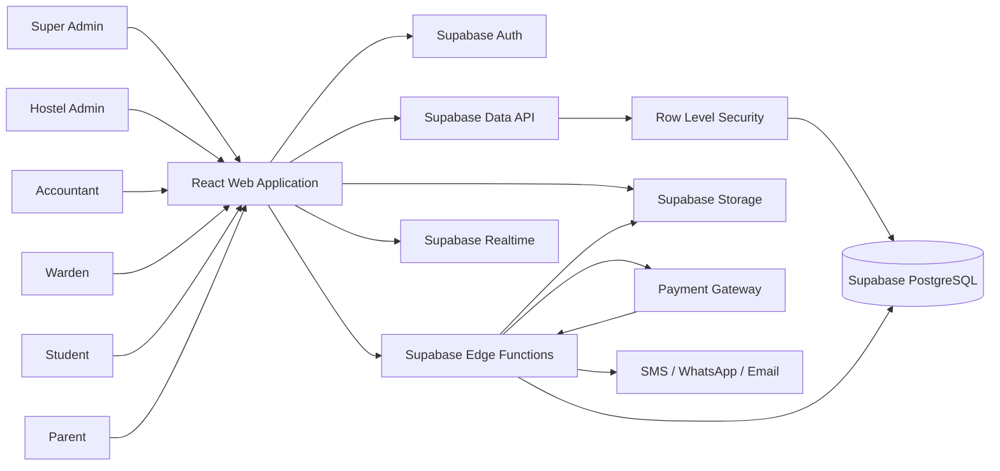
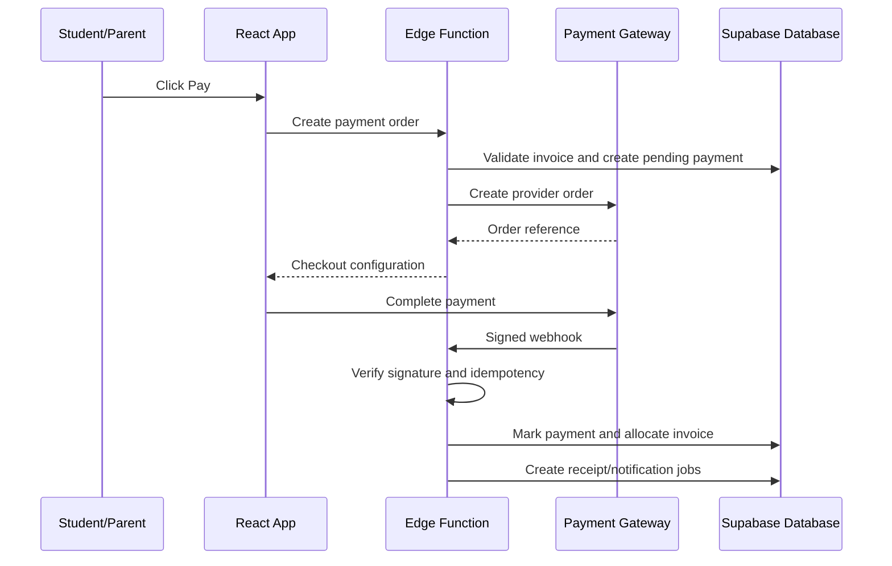

# Hostylia — Architecture.md

**Product:** Hostylia — Hostel & PG Management Platform  
**Company:** Jeevijay Technologies Private Limited  
**Architecture version:** 2.0  
**Based on:** PRD v2.1  
**Updated:** July 15, 2026  
**Status:** Living document  
**Confirmed technology stack:** React + TypeScript + Tailwind + shadcn/ui + Supabase

---

## 1. Purpose

This document converts the Hostylia PRD into a practical technical architecture.

It defines:

- Application structure
- React frontend architecture
- Supabase backend architecture
- Authentication
- Multi-tenancy
- Role-based access control
- Database and Row Level Security
- Storage
- Edge Functions
- Background jobs
- Payments
- Notifications
- Audit logging
- Testing
- Deployment
- Security and performance rules

This document must be used together with:

1. `PRD.md`
2. `Rules.md`
3. `Design.md`
4. `DB-Schema.md`
5. `Phases.md`
6. `Memory.md`

(Per-phase testing checklists live inside `Phases.md`.)

### Document priority

If documents conflict, follow this order:

1. `PRD.md` — product scope and requirements
2. `Rules.md` — implementation restrictions
3. `Architecture.md` — technical structure
4. `DB-Schema.md` — tables, relations, indexes and policies
5. `Design.md` — UI and UX rules
6. `Phases.md` — implementation sequence
7. `Memory.md` — current project progress

---

## 2. Confirmed Technology Stack

### 2.1 Frontend

- React
- Vite
- TypeScript (strict mode)
- TSX
- Tailwind CSS
- shadcn/ui (Radix primitives)
- React Router DOM
- Supabase JavaScript client (`@supabase/supabase-js`)
- TanStack Query
- React Hook Form
- Zod (validation + inferred types via `z.infer`)
- Zustand only where genuinely required
- Lucide React
- Recharts
- date-fns
- i18next or equivalent localization library

This is the Lovable-native stack. Styling is Tailwind + shadcn/ui only — no CSS Modules or second styling system (see `Rules.md` Sec. 9.10). Design tokens and the full palette live in `Design.md`.

### 2.2 Backend and data platform

- Supabase
- Supabase PostgreSQL
- Supabase Auth
- Supabase Storage
- Supabase Edge Functions
- Supabase Realtime where useful
- PostgreSQL Row Level Security
- PostgreSQL functions and triggers
- Supabase database migrations
- Scheduled jobs using Supabase Cron or approved PostgreSQL scheduling
- Database-backed job/outbox tables for retryable workflows

### 2.3 External integrations

- Razorpay or equivalent licensed Indian payment gateway
- SMS provider
- WhatsApp Business provider
- Transactional email provider
- PDF generation through Edge Function or approved document service
- Agreement acceptance in v1 is **click-wrap**: the resident accepts terms in-app and Hostylia records `accepted_at`, IP, user-agent and a document hash in the `agreements` table. No external e-sign vendor in v1.
- **Aadhaar eSign / DSC is a Stage 2 upgrade**, added only after legal and product approval; the `agreements` table is shaped to hold a future external-signature reference without migration churn.

### 2.4 Deployment

- React frontend deployed to Vercel, Netlify, Cloudflare Pages, or equivalent
- Supabase project for backend
- Separate Supabase projects for development, staging and production
- GitHub Actions or equivalent CI/CD
- India-region data hosting where supported and contractually valid

> Important: The PRD requires India data residency. Before production, the selected Supabase region and all third-party data processors must be verified against this requirement. If the required region is unavailable, production must not launch without an approved product/legal exception.

---

## 3. Architecture Style

Hostylia will use a **frontend-first Supabase architecture**.

```text
React Web App
    |
    |-- Supabase Auth
    |-- Supabase Data API
    |-- Supabase Storage
    |-- Supabase Realtime
    |
    `-- Supabase Edge Functions
            |
            |-- Sensitive business workflows
            |-- Payment integration
            |-- Notifications
            |-- PDF generation
            |-- Scheduled jobs
            `-- Third-party APIs
```

### 3.1 Architecture principle

The React application may directly use Supabase for operations that are fully protected by Row Level Security.

Sensitive operations must run through Edge Functions or secure PostgreSQL functions.

Examples of sensitive operations:

- Refund initiation and approval
- Discounts and waivers
- Payment order creation
- Payment webhook handling
- Tenant provisioning
- Role assignment
- Super Admin impersonation
- Bulk imports
- Financial report generation
- Data export and deletion
- Notification broadcasting
- Gate QR validation
- Audit-sensitive actions

### 3.2 Why this architecture

- Fewer backend services to maintain
- Fast development
- Built-in authentication
- PostgreSQL as the source of truth
- Strong Row Level Security
- Integrated storage
- Realtime support
- Edge Functions for secure workflows
- Suitable for Hostylia v1 and small-to-mid hostel operators

---

## 4. System Context



---

## 5. Application Surfaces

Hostylia has four primary interface families.

### 5.1 Super Admin Console

Used by Hostylia internal staff.

Includes:

- Tenant onboarding and offboarding
- Subscription and plan management
- Tenant billing status
- MRR and churn
- Feature flags
- Controlled impersonation
- Support activity
- Platform audit logs

### 5.2 Hostel Operations Console

Used by:

- Hostel Admin
- Accountant
- Warden

Includes:

- Property management
- Student management
- Rooms and beds
- Admissions and allocation
- Fees and invoices
- Payments and refunds
- Attendance
- Complaints
- Gate pass
- Visitor management
- Mess
- Notices
- Reports

### 5.3 Student Portal

Includes:

- Fee summary
- Online payment
- Complaints
- Gate-pass requests
- Mess menu
- Notices
- Room-swap requests
- Profile and documents

### 5.4 Parent Portal

Includes:

- Linked child selection
- Fee status and payments
- Attendance
- Gate history
- Complaint tracking
- Notices
- Warden messaging

All surfaces are delivered through one React application with role-aware routes and navigation.

---

## 6. Repository Structure

```text
hostylia/
├── src/
│   ├── app/
│   │   ├── App.tsx
│   │   ├── router.tsx
│   │   ├── providers.tsx
│   │   └── queryClient.ts
│   │
│   ├── assets/
│   ├── components/
│   │   ├── ui/
│   │   ├── forms/
│   │   ├── tables/
│   │   ├── charts/
│   │   ├── feedback/
│   │   ├── navigation/
│   │   └── layout/
│   │
│   ├── features/
│   │   ├── auth/
│   │   ├── tenants/
│   │   ├── subscriptions/
│   │   ├── properties/
│   │   ├── inventory/
│   │   ├── students/
│   │   ├── guardians/
│   │   ├── admissions/
│   │   ├── allocations/
│   │   ├── documents/
│   │   ├── finance/
│   │   ├── attendance/
│   │   ├── complaints/
│   │   ├── gate/
│   │   ├── visitors/
│   │   ├── mess/
│   │   ├── notices/
│   │   ├── messaging/
│   │   ├── reports/
│   │   └── super-admin/
│   │
│   ├── layouts/
│   │   ├── PublicLayout.tsx
│   │   ├── AuthLayout.tsx
│   │   ├── StaffLayout.tsx
│   │   ├── WardenLayout.tsx
│   │   ├── StudentLayout.tsx
│   │   ├── ParentLayout.tsx
│   │   └── SuperAdminLayout.tsx
│   │
│   ├── pages/
│   │   ├── public/
│   │   ├── auth/
│   │   ├── admin/
│   │   ├── accountant/
│   │   ├── warden/
│   │   ├── student/
│   │   ├── parent/
│   │   └── super-admin/
│   │
│   ├── hooks/
│   ├── lib/
│   │   ├── supabase.ts
│   │   ├── auth.ts
│   │   ├── permissions.ts
│   │   ├── queryKeys.ts
│   │   ├── errors.ts
│   │   ├── formatters.ts
│   │   └── constants.ts
│   │
│   ├── services/
│   │   ├── authService.ts
│   │   ├── propertyService.ts
│   │   ├── studentService.ts
│   │   ├── financeService.ts
│   │   ├── operationsService.ts
│   │   └── edgeFunctionService.ts
│   │
│   ├── stores/
│   ├── schemas/
│   ├── styles/
│   │   ├── tokens.css
│   │   ├── globals.css
│   │   ├── utilities.css
│   │   └── responsive.css
│   │
│   ├── i18n/
│   │   ├── en.json
│   │   ├── hi.json
│   │   └── index.ts
│   │
│   ├── tests/
│   └── main.tsx
│
├── public/
│
├── supabase/
│   ├── config.toml
│   ├── migrations/
│   ├── seed.sql
│   ├── functions/
│   │   ├── create-payment-order/
│   │   ├── payment-webhook/
│   │   ├── record-cash-payment/
│   │   ├── initiate-refund/
│   │   ├── approve-refund/
│   │   ├── generate-invoices/
│   │   ├── send-notification/
│   │   ├── process-notification-outbox/
│   │   ├── generate-receipt/
│   │   ├── bulk-import/
│   │   ├── export-data/
│   │   ├── scan-gate-qr/
│   │   ├── create-support-session/
│   │   └── close-support-session/
│   │
│   ├── tests/
│   │   ├── rls/
│   │   ├── functions/
│   │   └── database/
│   └── scripts/
│
├── docs/
│   ├── PRD.md
│   ├── Architecture.md
│   ├── Rules.md
│   ├── Design.md
│   ├── DB-Schema.md
│   ├── Phases.md
│   ├── Memory.md
│   └── adr/
│
├── .github/
│   └── workflows/
├── .env.example
├── eslint.config.js
├── jsconfig.json
├── package.json
├── vite.config.ts
└── README.md
```

---

## 7. React Frontend Architecture

## 7.1 Routing

Use React Router DOM.

Suggested route structure:

```text
/
├── /login
├── /verify-otp
├── /admission/:propertySlug
│
├── /super-admin/*
├── /admin/*
├── /accountant/*
├── /warden/*
├── /student/*
└── /parent/*
```

### Route protection

Route guards improve UX, but they are not security boundaries.

```text
RequireAuth
RequireRole
RequirePropertyScope
RequireFeatureFlag
```

All real security must be enforced through Supabase RLS, PostgreSQL functions and Edge Functions.

## 7.2 Layouts

### Staff layout

For Super Admin, Hostel Admin and Accountant:

- Desktop sidebar
- Top header
- Property switcher
- Breadcrumbs
- Search
- Notifications
- Dense tables
- Mobile drawer

### Warden layout

- Mobile-first
- Bottom navigation on mobile
- Quick actions
- Attendance
- Complaints
- Gate
- Mess
- Notices

### Student layout

Mobile bottom navigation:

```text
Home
Fees
Gate Pass
Complaints
Profile
```

### Parent layout

Mobile bottom navigation:

```text
Home
Payments
Attendance
Activity
Profile
```

## 7.3 State management

Use this priority:

1. URL state for filters, tabs, dates and pagination
2. TanStack Query for Supabase server data
3. Local React state
4. React Context for session, active property and layout
5. Zustand only for cross-screen client-only state

Do not duplicate Supabase query data inside global stores.

## 7.4 Forms

Use:

- React Hook Form
- Zod
- Shared field components
- Client validation
- Database and Edge Function validation

Rules:

- Backend/database validation is authoritative.
- Financial actions must not use optimistic updates.
- Long forms must warn about unsaved changes.
- File uploads must show progress.
- Errors must be available in English and Hindi.
- Every input must have a proper label.

## 7.5 Query conventions

Each feature must have centralized query keys.

Example:

```js
export const studentKeys = {
  all: ['students'],
  list: ({ tenantId, propertyId, filters }) => [
    'students',
    tenantId,
    propertyId,
    filters
  ],
  detail: ({ tenantId, studentId }) => [
    'student',
    tenantId,
    studentId
  ]
}
```

Query keys must include tenant and property context where relevant.

## 7.6 Supabase service pattern

React components should not contain large Supabase queries.

```text
Component
    -> Feature Hook
        -> Service
            -> Supabase Client or Edge Function
```

Example feature structure:

```text
features/complaints/
├── components/
├── hooks/
├── pages/
├── complaintService.ts
├── complaintQueries.ts
├── complaintSchema.ts
└── complaintUtils.ts
```

---

## 8. Supabase Backend Architecture

Supabase provides:

- PostgreSQL database
- Auth
- Storage
- Realtime
- Edge Functions
- Data API
- Database functions
- Row Level Security

### 8.1 Direct database access from React

Direct Supabase Data API access is allowed only when:

- RLS policy fully protects the operation
- No secret or service-role key is required
- The action is simple CRUD
- The action does not require cross-table financial transactions
- The action does not call privileged third-party APIs

Suitable examples:

- Student views own invoices
- Parent views linked child's attendance
- Warden views assigned complaints
- Student creates a complaint
- Student views notices
- Warden updates non-sensitive operational status where policy allows

### 8.2 Edge Functions

Use Edge Functions for:

- Payment order creation
- Payment webhook processing
- Refund workflows
- Waiver and discount approval
- Cash payment recording
- Receipt generation
- Bulk imports
- Tenant provisioning
- Subscription management
- Super Admin impersonation
- Notification sending
- Export generation
- Data deletion requests
- Gate QR validation
- Operations requiring service-role access

### 8.3 PostgreSQL functions

Use database functions for:

- Transactional business operations
- Atomic allocation and bed status updates
- Invoice status recalculation
- Payment allocation
- Refund validation
- Maker-checker validation
- Gate event creation
- Audit record creation
- Permission helper functions
- Tenant and relationship checks

PostgreSQL functions must use explicit security settings and must not create RLS bypasses accidentally.

---

## 9. Authentication

## 9.1 Login methods

### All roles

- Phone OTP through Supabase Auth

### Staff roles

- Email and password
- Phone OTP

### Student

- Phone OTP

### Parent

- Phone OTP

Email magic link for Parent remains an open product decision.

## 9.2 User profile model

Supabase Auth stores identity.

Application profile data belongs in public database tables.

```text
auth.users
    |
    `-- profiles
          |
          |-- role_assignments
          |-- property_assignments
          |-- block_assignments
          |-- student_profile
          `-- guardian_profile
```

Do not place all application data inside `auth.users.raw_user_meta_data`.

## 9.3 Session handling

Use the Supabase client session.

Requirements:

- Refresh session automatically
- Listen for auth state changes
- Clear query cache on logout
- Revalidate active tenant and role after login
- Revoke access after role removal
- Do not store service-role key in the browser
- Do not store custom authentication tokens in localStorage manually

## 9.4 OTP controls

- Request cooldown
- Attempt limits
- Expiry
- Per-phone rate limiting
- Per-IP rate limiting
- Generic error responses
- Audit suspicious activity

---

## 10. Multi-Tenant Architecture

## 10.1 Tenant hierarchy

```text
Tenant
└── Organization
    └── Property
        └── Block
            └── Floor
                └── Room
                    └── Bed
```

Block is optional for small properties.

## 10.2 Tenant columns

Every tenant-owned table must include:

```text
tenant_id uuid not null
```

Most operational tables must include:

```text
property_id uuid not null
```

Block-scoped tables may include:

```text
block_id uuid
```

## 10.3 Tenant context

Tenant access comes from authenticated role assignments.

Never trust a `tenant_id` sent by the browser without validating it against the authenticated user.

## 10.4 Isolation requirements

- RLS enabled on every tenant-owned table
- No anonymous access unless explicitly required
- Every RLS policy checks tenant membership
- Property and block scope checked where applicable
- Parent access checks active guardian relationship
- Student access checks self ownership
- Service-role use restricted to Edge Functions
- Cross-tenant tests mandatory
- Storage paths include tenant context
- Audit logs include tenant context

---

## 11. Roles and Authorization

The only v1 roles are:

```text
SUPER_ADMIN
HOSTEL_ADMIN
ACCOUNTANT
WARDEN
STUDENT
PARENT
```

No seventh role may be added without updating the PRD.

## 11.1 Authorization model

Authorization is based on:

```text
authenticated user
+ role
+ tenant membership
+ property assignment
+ block assignment
+ resource ownership
+ guardian relationship
+ feature entitlement
```

## 11.2 Role rules

### Super Admin

- Platform-level access
- Tenant provisioning
- Subscription management
- Feature flags
- Controlled support sessions
- No ordinary hostel operations without impersonation/support context

### Hostel Admin

- Full property control
- Finance
- Student management
- Staff invitations
- Reports
- All Warden and Accountant capabilities within assigned properties

### Accountant

- Fee plans
- Invoices
- Payments
- Receipts
- Refund initiation
- Finance reports
- No general property configuration
- No operational student data beyond finance need

### Warden

- Assigned properties or blocks
- Attendance
- Complaints
- Gate pass
- Gate events
- Visitors
- Mess
- Notices
- No revenue visibility by default

### Student

- Own profile
- Own fees
- Own complaints
- Own gate pass
- Own notices and mess data

### Parent

- Linked children only
- Child fees
- Child attendance
- Child gate history
- Child complaints
- Parent approval where applicable

---

## 12. Row Level Security

RLS is the primary database security layer.

## 12.1 Helper functions

Recommended helper functions:

```text
current_profile_id()
current_tenant_id()
has_role(role_name)
has_tenant_access(tenant_id)
has_property_access(property_id)
has_block_access(block_id)
is_hostel_admin(property_id)
is_accountant(property_id)
is_warden(property_id, block_id)
is_current_student(student_id)
is_guardian_of(student_id)
```

Helper functions must be reviewed for recursion and security-definer risks.

## 12.2 Policy examples

### Student reads own invoices

```sql
create policy "student can view own invoices"
on invoices
for select
using (
  student_id = current_student_id()
);
```

### Parent reads linked student's attendance

```sql
create policy "parent can view linked student attendance"
on attendance
for select
using (
  is_guardian_of(student_id)
);
```

### Warden views assigned complaints

```sql
create policy "warden views assigned scope complaints"
on complaints
for select
using (
  has_role('WARDEN')
  and has_property_access(property_id)
  and (
    block_id is null
    or has_block_access(block_id)
  )
);
```

These are conceptual examples. Final SQL belongs in `DB-Schema.md` and migrations.

## 12.3 Service-role rules

The Supabase service-role key:

- Must never be included in React code
- Must never be placed in public environment variables
- May be used only in secure Edge Functions or controlled server environments
- Must not be used to bypass business validation
- Must create explicit audit entries

---

## 13. Database Architecture

## 13.1 Core entity groups

### Platform

- tenants
- organizations
- subscriptions
- plans
- plan_features
- tenant_features
- support_sessions

### Identity and access

- profiles
- role_assignments
- property_assignments
- block_assignments
- guardian_student_links

### Property

- properties
- blocks
- floors
- rooms
- beds

### Student lifecycle

- students
- guardians
- admissions
- allocations
- move_outs
- documents
- agreements

### Finance

- fee_plans
- fee_components
- invoices
- invoice_items
- payments
- payment_allocations
- receipts
- refunds
- discounts
- waivers
- deposit_ledger_entries

### Operations

- attendance
- complaints
- complaint_activities
- gate_passes
- gate_events
- visitors
- mess_menus
- mess_feedback
- notices
- conversations
- messages

### Platform operations

- notifications
- notification_attempts
- notification_outbox
- import_jobs
- export_jobs
- webhook_events
- idempotency_keys
- audit_logs

## 13.2 General database rules

- Use UUID primary keys
- Store timestamps as `timestamptz`
- Store money in paise as integer/bigint
- Store currency separately
- Use explicit status enums or checked text values
- Use foreign keys
- Use unique constraints
- Use soft delete for business data
- Preserve allocation history
- Preserve financial history
- Use snapshots for rent and fee values
- Avoid unstructured JSON for core business relations

## 13.3 Soft delete

Business entities should use:

```text
deleted_at
deleted_by
deletion_reason
```

RLS and queries must exclude soft-deleted rows by default.

Hard delete requires a controlled Super Admin process.

## 13.4 Database triggers

Triggers may be used for:

- `updated_at`
- immutable audit inserts
- invoice status recalculation
- occupancy consistency
- notification outbox creation
- financial integrity checks

Do not hide large business workflows inside undocumented triggers.

---

## 14. Audit Logging

Every important mutation must create an audit record.

Required fields:

```text
id
tenant_id
property_id
actor_user_id
effective_user_id
support_session_id
action
entity_type
entity_id
before_data
after_data
request_id
ip_address
user_agent
created_at
```

Sensitive values must be redacted.

Audit logs must cover:

- Role changes
- Property changes
- Student changes
- Bed allocation
- Financial actions
- Refunds
- Waivers
- Attendance changes
- Complaint changes
- Gate events
- Support impersonation
- Feature-flag changes
- Data exports
- Privacy deletion requests

---

## 15. Financial Architecture

## 15.1 Payment flow



The browser payment response is not authoritative. The signed webhook is authoritative.

## 15.2 Payment security

- No card data stored
- Verify webhook signatures
- Verify amount and currency
- Store provider references
- Use idempotency
- Handle duplicate webhooks safely
- Record webhook payload metadata securely
- Financial updates must be transactional

## 15.3 Cash and cheque

Cash and cheque recording must go through an Edge Function or secure database function.

Required:

- Actor
- Property
- Student
- Invoice
- Amount
- Mode
- Reference
- Payment date
- Receipt number
- Audit log

## 15.4 Refund maker-checker

Refund flow:

```text
DRAFT
PENDING_APPROVAL
APPROVED
PROCESSING
COMPLETED
REJECTED
FAILED
CANCELLED
```

Rules:

- Accountant may initiate
- Hostel Admin approves
- Initiator cannot approve own action where maker-checker applies
- Approval reason required
- Threshold configurable
- All transitions audited

---

## 16. Background Jobs

Supabase does not require a separate traditional backend server, but retryable work still needs a durable job design.

## 16.1 Recommended pattern

```text
Business transaction
    -> insert outbox/job row
    -> scheduled processor or Edge Function reads pending jobs
    -> provider call
    -> update attempt and final status
```

## 16.2 Job categories

- Invoice generation
- Fee reminders
- Notifications
- Receipt generation
- Complaint SLA checks
- Gate late-entry checks
- Bulk imports
- Exports
- Subscription checks
- Data retention
- Backup verification

## 16.3 Job table fields

```text
id
tenant_id
property_id
job_type
payload
status
attempt_count
max_attempts
run_after
locked_at
last_error
created_at
completed_at
```

## 16.4 Job rules

- Idempotent
- Retryable
- Exponential backoff
- Maximum attempt limit
- Dead-letter state
- Tenant context included
- Sensitive data minimized
- Structured logs
- No duplicate notifications

---

## 17. Notification Architecture

Channels:

```text
IN_APP
SMS
WHATSAPP
EMAIL
```

Web push is Stage 2.

## 17.1 Flow

```text
Domain action
    -> notification_outbox
    -> notification processor
    -> template resolver
    -> provider adapter
    -> notification_attempt
    -> final delivery status
```

## 17.2 Events

Examples:

```text
invoice.issued
invoice.overdue
payment.received
receipt.generated
refund.approved
refund.completed
attendance.absent
gate.exit
gate.entry
gate.late
complaint.created
complaint.resolved
complaint.sla_breached
notice.published
```

## 17.3 Rules

- Templates are versioned
- English and Hindi variants
- Provider credentials stored as secrets
- Retry transient errors
- Track delivery status
- Respect communication consent
- Avoid duplicate sends
- Tenant branding only where allowed

---

## 18. Supabase Storage

## 18.1 Buckets

Recommended private buckets:

```text
kyc-documents
student-media
property-media
complaint-media
visitor-documents
agreements
receipts
exports
```

Public property images may use a separate controlled public bucket.

## 18.2 Storage path

```text
{tenantId}/{propertyId}/{entityType}/{entityId}/{fileId}
```

## 18.3 Storage security

- Private by default
- Signed URLs
- Storage RLS policies
- Tenant-scoped paths
- MIME type allowlist
- File size limits
- Audit sensitive file access
- Do not expose KYC as public URLs
- Remove metadata where appropriate
- Validate upload ownership before saving document record

---

## 19. Realtime

Use Supabase Realtime selectively.

Suitable cases:

- New notices
- Complaint status updates
- Parent-visible gate events
- Warden gate event stream
- Payment status refresh
- Support session banner

Do not enable broad Realtime subscriptions on large tables without filters.

Rules:

- Subscribe only to the active tenant/property
- Unsubscribe on route change and logout
- Treat Realtime as an update signal
- Re-fetch authoritative data after important events
- Do not use Realtime to bypass RLS

---

## 20. Gate QR Architecture

The QR must contain a signed or opaque token, not raw student data.

Validation must check:

- Tenant
- Property
- Student
- Gate-pass status
- Valid time
- Direction
- Duplicate scan
- Parent approval when required
- Warden/property access

Recommended flow:

```text
React scanner
    -> scan-gate-qr Edge Function
    -> validate token
    -> transactional gate event
    -> notification outbox
    -> parent SMS/WhatsApp
```

Gate scanning must work on shared Warden/front-desk devices without introducing a new role in v1.

---

## 21. Complaint Architecture

Complaint states:

```text
OPEN
ASSIGNED
IN_PROGRESS
WAITING_FOR_STUDENT
RESOLVED
CLOSED
REOPENED
CANCELLED
```

Flow:

1. Student creates complaint.
2. System determines property/block.
3. Warden is assigned.
4. SLA deadline calculated.
5. Reminder and escalation jobs created.
6. Warden adds updates.
7. Warden closes with proof.
8. Student rates or reopens within allowed time.

Complaint media uses private Supabase Storage.

---

## 22. Allocation and Occupancy

Bed states:

```text
VACANT
OCCUPIED
BLOCKED
MAINTENANCE
```

Allocation states:

```text
DRAFT
PENDING_AGREEMENT
PENDING_PAYMENT
ACTIVE
NOTICE_GIVEN
MOVE_OUT_INSPECTION
CLOSED
CANCELLED
```

Allocation and bed updates must happen atomically through a PostgreSQL function or Edge Function.

Example:

```text
create_allocation()
swap_allocation()
activate_allocation()
start_move_out()
complete_move_out()
```

The system must prevent:

- Two active students in one bed
- One student with multiple active beds
- Allocation into blocked or maintenance bed
- Cross-property allocation
- Occupancy status mismatch

---

## 23. Localization

v1 languages:

- English
- Hindi

Rules:

- UI strings use translation keys
- Validation messages localized
- Notification templates localized
- Dates formatted by locale
- Currency defaults to INR
- Property timezone defaults to `Asia/Kolkata`
- Database timestamps stored with timezone

---

## 24. Responsive and Mobile Architecture

Hostylia is a responsive web application, not a native app.

Requirements:

- Fully usable from 360px
- Primary design target 375px
- Touch target at least 44px
- Bottom navigation for Student, Parent and Warden
- Camera input for KYC, complaint and visitor photos
- No hover-only actions
- Tables adapt to mobile cards or controlled horizontal scrolling
- Critical actions remain easily reachable
- Mobile browser back behavior must work correctly

PWA offline support is Stage 2.

---

## 25. Security

## 25.1 Mandatory security controls

- RLS on all tenant-owned tables
- Least-privilege policies
- No service-role key in frontend
- Edge Function secret management
- Input validation
- Output encoding
- Rate limiting
- OTP abuse prevention
- Signed payment webhooks
- Signed gate tokens
- Private file storage
- Sensitive log redaction
- Audit logging
- Dependency scanning
- Environment separation

## 25.2 Sensitive information

Sensitive data includes:

- KYC
- Guardian details
- Student medical flags
- Phone numbers
- Payment references
- Complaint media
- Visitor IDs
- Authentication details

Sensitive data must:

- Be stored only where necessary
- Be protected by RLS
- Not appear in analytics
- Not appear in client logs
- Not be exposed through public URLs
- Be exportable and deletable through approved privacy workflows

---

## 26. Performance

PRD targets:

- Dashboard under 2 seconds at p95
- Normal API/data operations under 200 ms at p95 where practical
- 99.9% availability target

## 26.1 Frontend

- Route-level lazy loading
- TanStack Query caching
- Paginated data
- Debounced search
- Image optimization
- Deferred charts
- Avoid large bundles
- Avoid unnecessary Realtime subscriptions
- Skeleton loaders
- Memoization only where measured

## 26.2 Database

- Composite tenant/property indexes
- Avoid N+1 queries
- Use database views for reports where appropriate
- Use materialized views only when justified
- Pagination on all large lists
- Query limits
- Explain/analyze slow queries
- Index foreign keys and common filters

Example indexes:

```text
(tenant_id, property_id)
(tenant_id, property_id, status)
(tenant_id, student_id)
(tenant_id, due_date, status)
(tenant_id, block_id, date)
(tenant_id, created_at)
```


## 26.3 Scale Seams and Capacity

Hostylia's target market is Indian coaching-institute hostels and PGs. At that scale the binding constraint is **concurrency and connection discipline**, not row count — Postgres handles the data volume comfortably. This section documents the deliberate seams that let the system scale later without a rewrite, and the rules that keep v1 healthy.

### Capacity posture (v1, Supabase Pro)

- 50k+ registered users (students, parents, staff) is comfortable on Supabase Pro. The database size is small; the risks are concurrency-shaped:
  - **Connection exhaustion** — all access goes through the Supabase pooler (Supavisor/PgBouncer). No direct unpooled connections from Edge Functions or clients. This is the single most important scaling rule (see `Rules.md` Sec. 23.1b).
  - **Fee-cycle spikes** — invoice generation and reminder batches run as bounded `background_jobs`, never as one synchronous sweep (`Rules.md` Sec. 23.1a).
  - **OTP/SMS spikes on signup** — capped by the rate limiter below.
- A load test against realistic concurrent-active numbers (a fraction of total registered users) is required before launch. The capacity statement here is a design posture, not a load-tested guarantee.

### Documented seams (deferred, not built in v1)

| Concern | v1 implementation | Future upgrade (Stage 3, behind the same seam) |
|---|---|---|
| Rate limiting | `checkRateLimit(key, limit, windowSeconds)` — Postgres `SECURITY DEFINER` function over the `rate_limits` table | Swap the function body to call **Upstash Redis over HTTP**. No call site changes. |
| Read-heavy reporting | Primary Postgres + indexed views | Supabase **read replicas**; point read-only report queries at the replica. |
| Background work | `background_jobs` outbox + scheduled Edge Functions | Dedicated **worker tier** consuming the same job table. |
| Caching hot aggregates | Indexed views + TanStack Query client cache | Optional cache layer behind a service function. |

Each seam is a single, named indirection point. Redis, replicas, and a worker tier are **out-of-band components Lovable cannot manage**, so introducing any of them requires an ADR (`Rules.md` Sec. 36.3) and is explicitly deferred (`Rules.md` Sec. 3.4). The rate-limiter seam is the reference pattern: one function, one call path, storage swappable underneath.

---

## 27. Error Handling

Standard error categories:

```text
VALIDATION_ERROR
AUTHENTICATION_REQUIRED
SESSION_EXPIRED
PERMISSION_DENIED
TENANT_SCOPE_VIOLATION
PROPERTY_SCOPE_VIOLATION
RESOURCE_NOT_FOUND
RESOURCE_CONFLICT
DUPLICATE_REQUEST
RATE_LIMITED
PAYMENT_PENDING
PAYMENT_FAILED
WEBHOOK_INVALID
FILE_TOO_LARGE
UNSUPPORTED_FILE_TYPE
SERVICE_UNAVAILABLE
INTERNAL_ERROR
```

UI must distinguish:

- Validation issue
- Session expired
- Permission denied
- Offline/network error
- Payment pending
- Payment failed
- Duplicate action
- Server error
- Provider outage

Every error screen must provide a recovery action.

---

## 28. Testing Strategy

## 28.1 Frontend tests

- Vitest
- React Testing Library
- Playwright for end-to-end tests

Test:

- Route guards
- Forms
- Responsive navigation
- Loading and error states
- Role-specific UI
- English/Hindi rendering
- Accessibility
- Payment pending states
- File uploads

## 28.2 Supabase tests

Test:

- RLS policies
- Cross-tenant isolation
- Property and block scope
- Parent-child links
- Student self access
- Financial permissions
- Service-role Edge Functions
- Database functions
- Triggers
- Idempotency
- Payment webhooks
- Storage policies

## 28.3 Critical end-to-end journeys

1. Tenant onboarding
2. Property creation
3. Room and bed setup
4. Student admission
5. Bed allocation
6. Invoice creation
7. Online payment
8. Cash payment
9. Refund approval
10. Complaint lifecycle
11. Gate-pass approval and scan
12. Parent access
13. Move-out
14. Super Admin support session

---

## 29. CI/CD

Pipeline:

```text
Pull Request
    -> lint
    -> unit tests
    -> React build
    -> Supabase migration validation
    -> RLS tests
    -> Edge Function tests
    -> deploy staging
    -> Playwright tests
    -> manual production approval
    -> production deployment
    -> smoke tests
```

Rules:

- Separate development, staging and production projects
- Never test against production
- Migration files committed to Git
- Backward-compatible migrations
- Rollback plan
- Environment secrets managed securely
- Production changes through CI/CD, not manual dashboard editing

---

## 30. Backups and Recovery

Use Supabase backup and recovery capabilities appropriate to the selected production plan.

Requirements:

- Daily backups
- 30-day retention
- Point-in-time recovery where required
- Backup encryption
- India-region compliance
- Periodic restore tests
- Export of critical configuration
- Recovery runbooks

Final RPO and RTO remain business decisions and must not be invented by engineering.

---

## 31. Observability

Track:

- React errors
- Edge Function errors
- Database errors
- Slow queries
- Auth failures
- OTP failures
- Payment webhook failures
- Notification failures
- Job backlog
- Storage errors
- RLS denial patterns
- Cross-tenant violation attempts
- Backup failures

Recommended:

- Supabase logs
- Structured Edge Function logs
- External frontend error monitoring
- Request/correlation IDs
- Alerts for payment and notification failures

Do not log sensitive personal data.

---

## 32. Feature Flags

Feature flags support:

- Tenant-level rollout
- Subscription plan access
- Staged releases
- Emergency disablement
- Stage 2 features

Examples:

```text
public_property_microsite
pwa_install
web_push
split_payments
waitlist
warden_privilege_toggles
multi_property_staff_assignment
```

Feature flags do not replace RLS or authorization.

---

## 33. Open Architecture Decisions

### ADR-001 — Multiple Wardens

Architecture supports:

- Many Wardens per property
- Many Wardens per block
- Multiple block assignments per Warden

Final assignment rules remain open.

### ADR-002 — Accountant seat pricing

Subscription tables support seat limits and feature entitlements.

Whether Accountant is included or paid is a product decision.

### ADR-003 — Front-desk gate mode

Current architecture uses Warden access and device/session metadata.

No new role will be added unless PRD changes.

### ADR-004 — Parent email magic link

Identity structure supports future email magic link.

v1 defaults to phone OTP.

### ADR-005 — Refund SLA

Refund table can store expected completion date.

Final SLA remains a product decision.

### ADR-006 — Supabase data region

Before production:

- Verify India-region availability
- Verify database, storage and backups
- Verify third-party processors
- Record decision in an ADR

---

## 34. v1 Boundaries

### Included

- React web application
- Supabase backend
- Six-role model
- Multi-tenant database
- RLS
- Property hierarchy
- Student lifecycle
- Finance
- Attendance
- Complaints
- Gate pass
- Visitors
- Mess
- Notices
- Student portal
- Parent portal
- Super Admin console
- English and Hindi
- Responsive web experience

### Stage 2

- PWA
- Offline attendance
- Offline gate scanning
- Web push
- Split payments
- Waitlist
- Public listing microsite
- Granular role privilege toggles
- Enhanced multi-property staff assignments

### Stage 3

- AI suite
- Biometrics
- Public API
- Public webhooks
- Bank reconciliation
- Accounting exports
- BI connectors
- Additional languages
- Custom reports

---

## 35. Rules for AI Coding Agents

Before coding, the AI must:

1. Read `PRD.md`.
2. Read `Rules.md`.
3. Read `Architecture.md`.
4. Read the active section of `Phases.md`.
5. Read `Memory.md`.
6. Use React, Vite, JavaScript and JSX.
7. Use Supabase as the backend.
8. Preserve the six-role model.
9. Never add a new role without PRD approval.
10. Never disable RLS to make a feature work.
11. Never expose the service-role key in React.
12. Never trust frontend role checks as security.
13. Never perform sensitive finance workflows as unrestricted browser CRUD.
14. Use Edge Functions or secure PostgreSQL functions for privileged actions.
15. Add tenant and property scope to every relevant query.
16. Add tests for RLS and role permissions.
17. Never hard-delete business data through normal flows.
18. Never expose KYC through public storage.
19. Do not build Stage 2 or Stage 3 functionality during v1.
20. Update `Memory.md` after completing work.

---

## 36. Definition of Architecture Compliance

A feature is compliant when:

- It exists in the PRD scope.
- It uses React and Supabase.
- Its database tables have proper tenant scope.
- RLS is enabled and tested.
- Role and relationship access is enforced.
- Sensitive workflows use Edge Functions or secure database functions.
- Financial mutations are transactional and audited.
- Files use secure storage policies.
- Errors are handled consistently.
- Mobile behavior is implemented.
- English and Hindi support is preserved.
- Tests are added.
- No deferred feature or unauthorized role is introduced.
- Documentation and `Memory.md` are updated.

---

## 37. Architecture Summary

| Area | Decision |
|---|---|
| Frontend | React + Vite |
| Language | TypeScript (strict) + TSX |
| Routing | React Router DOM |
| Data fetching | TanStack Query + Supabase client |
| Forms | React Hook Form + Zod (shared schemas, `z.infer` types) |
| Backend | Supabase |
| Database | Supabase PostgreSQL |
| Authentication | Supabase Auth |
| Authorization | RLS + role/property/block/relationship checks |
| Secure workflows | Supabase Edge Functions + PostgreSQL functions |
| Storage | Supabase Storage |
| Realtime | Supabase Realtime, selectively |
| Background work | Database outbox/jobs + scheduled Edge Functions |
| Payments | Razorpay-compatible Edge Functions |
| Notifications | SMS, WhatsApp, email adapters |
| Deployment | Static React hosting + Supabase |
| Styling | Tailwind CSS + shadcn/ui (semantic tokens, no raw hex) |
| Rate limiting | Postgres `checkRateLimit()` in v1; Upstash Redis is the documented Stage-3 swap |
| E-signature | Click-wrap in v1; Aadhaar eSign in Stage 2 |
| Mobile | Responsive web, no native app |
| v1 exclusions | AI, biometrics, public API, native app, extra roles |

---

## 38. Next Documents

After approving this architecture, create:

1. `Rules.md`
2. `DB-Schema.md`
3. `Design.md`
4. `Phases.md`
5. `Memory.md`

---

*End of Architecture.md*
