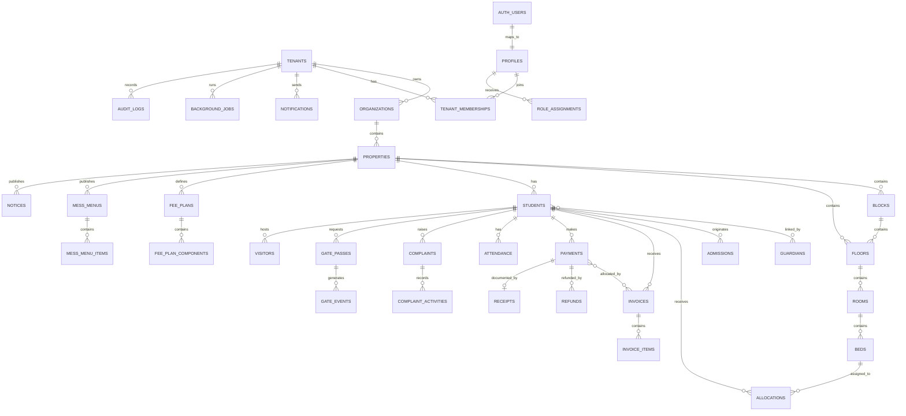

# Hostylia — DB-Schema.md

**Product:** Hostylia — Hostel & PG Management Platform  
**Company:** Jeevijay Technologies Private Limited  
**Database:** Supabase PostgreSQL  
**Schema version:** 1.1  
**Based on:** PRD v2.1 and React + TypeScript + Supabase Architecture v2.0  
**Last updated:** July 15, 2026  
**Status:** Living document  
**Primary schema:** `public`  
**Authentication schema:** `auth` managed by Supabase  
**Storage schema:** `storage` managed by Supabase

---

## 1. Purpose

This document defines the logical and physical database design for Hostylia.

It covers:

- Multi-tenant data isolation
- Authentication-linked application profiles
- Six-role access model
- Organization and property hierarchy
- Student and guardian lifecycle
- Room and bed allocation
- Fees, invoices, payments, receipts, refunds, discounts and deposits
- Attendance, complaints, gate passes, visitors, mess and notices
- Student-parent messaging
- SaaS subscriptions and feature controls
- Notifications and background jobs
- Audit logs
- Row Level Security
- Database functions
- Triggers
- Indexes
- Reporting views
- Retention and soft deletion
- Supabase Storage organization

This file is a schema blueprint. Final implementation must be delivered through version-controlled Supabase migrations.

---

## 2. Source-of-Truth Order

If schema decisions conflict with another document, follow this order:

1. `PRD.md`
2. `Rules.md`
3. `Architecture.md`
4. `DB-Schema.md`
5. `Design.md`
6. `Phases.md`
7. `Memory.md`

No table, role or workflow may expand v1 product scope without a PRD update.

---

## 3. Database Design Principles

### 3.1 PostgreSQL is the system of record

Supabase PostgreSQL stores all authoritative product data.

The browser must never be treated as the source of truth for:

- Permissions
- Tenant scope
- Payments
- Refunds
- Fee balances
- Bed occupancy
- Gate events
- Audit history
- Subscription status

### 3.2 Shared-database multi-tenancy

Hostylia v1 uses a shared PostgreSQL database with tenant-level isolation.

Every tenant-owned business table must include:

```text
tenant_id uuid not null
```

Most operational tables must also include:

```text
property_id uuid not null
```

Block-scoped data may additionally include:

```text
block_id uuid
```

### 3.3 Row Level Security is mandatory

RLS must be enabled on every tenant-owned table.

Frontend role checks are only for user experience. Real security is enforced by:

- Supabase Auth
- RLS
- Database functions
- Relationship checks
- Edge Functions for privileged operations

### 3.4 Financial history is immutable

Financial records may be corrected through reversal, adjustment, void or refund workflows.

They must not be silently overwritten or hard-deleted.

### 3.5 Soft deletion

Business entities use soft deletion unless a legally approved hard-delete workflow applies.

### 3.6 Explicit workflow states

Important entities must use explicit state values and validated transitions.

### 3.7 Money storage

All money values are stored in the smallest currency unit.

For INR:

```text
100 rupees = 10000 paise
```

Recommended type:

```sql
bigint
```

Currency is stored separately as a three-letter code, defaulting to `INR`.

### 3.8 Time storage

- Use `timestamptz`
- Store timestamps in UTC
- Render using property timezone
- Default India property timezone: `Asia/Kolkata`

### 3.9 Public IDs

Use UUIDs for database primary keys.

Human-readable numbers such as invoice numbers and receipt numbers are separate fields.

---

## 4. Schemas

### 4.1 `auth`

Managed by Supabase.

Primary table:

```text
auth.users
```

Do not place complete business profiles in Auth metadata.

### 4.2 `public`

Contains Hostylia application tables, views and RPC functions.

### 4.3 `storage`

Managed by Supabase Storage.

Application document metadata remains in `public.documents`.

### 4.4 Optional private schema

Security-definer helper functions may be placed in a restricted schema such as:

```text
private
```

Only approved functions should be executable by authenticated users.

---

## 5. Extension Requirements

Recommended PostgreSQL extensions:

```sql
create extension if not exists pgcrypto;
create extension if not exists citext;
create extension if not exists pg_trgm;
```

Optional based on final deployment:

```sql
create extension if not exists pg_cron;
```

Use Supabase-supported scheduling options for production.

---

## 6. Naming Conventions

### Tables

```text
snake_case
plural nouns
```

Examples:

```text
students
fee_plans
gate_events
```

### Columns

```text
snake_case
```

### Primary keys

```text
id
```

### Foreign keys

```text
<entity>_id
```

### Timestamps

```text
created_at
updated_at
deleted_at
```

### Boolean fields

Prefer clear names:

```text
is_primary
is_active
portal_access_enabled
requires_parent_approval
```

### Indexes

```text
idx_<table>_<columns>
uidx_<table>_<columns>
```

### Constraints

```text
chk_<table>_<rule>
fk_<table>_<related_table>
uq_<table>_<columns>
```

---

## 7. Shared Column Conventions

Most tenant-owned business tables should include the following where appropriate:

| Column | Type | Rules |
|---|---|---|
| `id` | `uuid` | Primary key, default `gen_random_uuid()` |
| `tenant_id` | `uuid` | Required, references `tenants.id` |
| `property_id` | `uuid` | Required for property-scoped data |
| `created_at` | `timestamptz` | Required, default `now()` |
| `updated_at` | `timestamptz` | Required, default `now()` |
| `created_by` | `uuid` | Nullable, references `profiles.id` |
| `updated_by` | `uuid` | Nullable, references `profiles.id` |
| `deleted_at` | `timestamptz` | Nullable |
| `deleted_by` | `uuid` | Nullable, references `profiles.id` |
| `deletion_reason` | `text` | Nullable |

Not every append-only table needs `updated_at` or soft-delete columns.

Examples of append-only tables:

- `audit_logs`
- `gate_events`
- `notification_attempts`
- `webhook_events`
- `deposit_ledger_entries`

---

## 8. Stable Role Values

The only v1 roles are:

```text
SUPER_ADMIN
HOSTEL_ADMIN
ACCOUNTANT
WARDEN
STUDENT
PARENT
```

No additional role may be introduced without updating the PRD.

Recommended type:

```sql
create type app_role as enum (
  'SUPER_ADMIN',
  'HOSTEL_ADMIN',
  'ACCOUNTANT',
  'WARDEN',
  'STUDENT',
  'PARENT'
);
```

Because these six values are central and intentionally constrained, a native enum is acceptable.

Workflow statuses that may evolve should generally use `text` with `check` constraints rather than PostgreSQL enums.

---

# PART A — PLATFORM AND TENANCY

## 9. `tenants`

Represents a Hostylia customer account.

Usually one tenant maps to one hostel operator or hostel chain.

| Column | Type | Rules |
|---|---|---|
| `id` | `uuid` | PK |
| `slug` | `citext` | Required, unique |
| `display_name` | `text` | Required |
| `legal_name` | `text` | Nullable |
| `status` | `text` | `TRIAL`, `ACTIVE`, `PAST_DUE`, `SUSPENDED`, `CANCELLED` |
| `default_locale` | `text` | Default `en` |
| `default_currency` | `char(3)` | Default `INR` |
| `timezone` | `text` | Default `Asia/Kolkata` |
| `onboarding_status` | `text` | `NOT_STARTED`, `IN_PROGRESS`, `COMPLETED`, `BLOCKED` |
| `created_at` | `timestamptz` | Default `now()` |
| `updated_at` | `timestamptz` | Default `now()` |
| `suspended_at` | `timestamptz` | Nullable |
| `cancelled_at` | `timestamptz` | Nullable |

### Constraints

```text
slug must be normalized
status must match allowed values
currency must be uppercase
```

### Indexes

```text
unique(slug)
index(status)
index(created_at)
```

---

## 10. `organizations`

Represents the owner, company or chain under a tenant.

| Column | Type | Rules |
|---|---|---|
| `id` | `uuid` | PK |
| `tenant_id` | `uuid` | Required |
| `name` | `text` | Required |
| `legal_name` | `text` | Nullable |
| `gstin` | `text` | Nullable |
| `pan_last4` | `text` | Nullable; do not store full PAN unless approved |
| `billing_email` | `citext` | Nullable |
| `billing_phone` | `text` | Nullable |
| `registered_address` | `jsonb` | Nullable; structured address |
| `status` | `text` | `ACTIVE`, `INACTIVE` |
| standard audit columns |  |  |

### Relationships

```text
tenant 1 -> n organizations
organization 1 -> n properties
```

### Constraints

```text
unique(tenant_id, name) where deleted_at is null
gstin validation handled by application/database check where practical
```

---

## 11. `plans`

Defines Hostylia SaaS plans.

| Column | Type | Rules |
|---|---|---|
| `id` | `uuid` | PK |
| `code` | `citext` | Unique |
| `name` | `text` | Required |
| `description` | `text` | Nullable |
| `billing_interval` | `text` | `MONTHLY`, `QUARTERLY`, `YEARLY`, `CUSTOM` |
| `price_paise` | `bigint` | Non-negative |
| `currency` | `char(3)` | Default `INR` |
| `trial_days` | `integer` | Default `0` |
| `max_properties` | `integer` | Nullable means unlimited |
| `max_staff_seats` | `integer` | Nullable |
| `is_active` | `boolean` | Default `true` |
| `created_at` | `timestamptz` | Default `now()` |
| `updated_at` | `timestamptz` | Default `now()` |

---

## 12. `plan_features`

Defines feature entitlements for plans.

| Column | Type | Rules |
|---|---|---|
| `id` | `uuid` | PK |
| `plan_id` | `uuid` | Required |
| `feature_key` | `text` | Required |
| `enabled` | `boolean` | Default `false` |
| `limit_value` | `bigint` | Nullable |
| `configuration` | `jsonb` | Default `{}` |
| `created_at` | `timestamptz` | Default `now()` |
| `updated_at` | `timestamptz` | Default `now()` |

### Constraint

```text
unique(plan_id, feature_key)
```

---

## 13. `subscriptions`

Tracks each tenant's SaaS subscription.

| Column | Type | Rules |
|---|---|---|
| `id` | `uuid` | PK |
| `tenant_id` | `uuid` | Required |
| `plan_id` | `uuid` | Required |
| `status` | `text` | `TRIAL`, `ACTIVE`, `PAST_DUE`, `PAUSED`, `CANCELLED` |
| `starts_at` | `timestamptz` | Required |
| `trial_ends_at` | `timestamptz` | Nullable |
| `current_period_start` | `timestamptz` | Nullable |
| `current_period_end` | `timestamptz` | Nullable |
| `cancel_at_period_end` | `boolean` | Default `false` |
| `cancelled_at` | `timestamptz` | Nullable |
| `provider` | `text` | Nullable |
| `provider_customer_ref` | `text` | Nullable |
| `provider_subscription_ref` | `text` | Nullable |
| `created_at` | `timestamptz` | Default `now()` |
| `updated_at` | `timestamptz` | Default `now()` |

### Indexes

```text
index(tenant_id, status)
unique(provider, provider_subscription_ref) where provider_subscription_ref is not null
```

---

## 14. `tenant_feature_overrides`

Allows Super Admin to enable or disable a feature per tenant.

| Column | Type | Rules |
|---|---|---|
| `id` | `uuid` | PK |
| `tenant_id` | `uuid` | Required |
| `feature_key` | `text` | Required |
| `enabled` | `boolean` | Required |
| `limit_value` | `bigint` | Nullable |
| `configuration` | `jsonb` | Default `{}` |
| `reason` | `text` | Required |
| `expires_at` | `timestamptz` | Nullable |
| `created_by` | `uuid` | Required |
| `created_at` | `timestamptz` | Default `now()` |
| `updated_at` | `timestamptz` | Default `now()` |

### Constraint

```text
unique(tenant_id, feature_key)
```

---

## 15. `support_sessions`

Controls Super Admin impersonation.

| Column | Type | Rules |
|---|---|---|
| `id` | `uuid` | PK |
| `tenant_id` | `uuid` | Required |
| `super_admin_user_id` | `uuid` | Required |
| `target_user_id` | `uuid` | Required |
| `reason` | `text` | Required |
| `support_reference` | `text` | Nullable |
| `consent_recorded` | `boolean` | Default `false` |
| `access_mode` | `text` | `READ_ONLY`, `STANDARD`, `ELEVATED` |
| `started_at` | `timestamptz` | Required |
| `expires_at` | `timestamptz` | Required; maximum 60 minutes |
| `ended_at` | `timestamptz` | Nullable |
| `ended_reason` | `text` | Nullable |
| `created_at` | `timestamptz` | Default `now()` |

### Constraints

```text
expires_at <= started_at + interval '60 minutes'
target_user_id != super_admin_user_id
```

---

# PART B — IDENTITY AND ACCESS

## 16. `profiles`

Application profile linked one-to-one with `auth.users`.

| Column | Type | Rules |
|---|---|---|
| `id` | `uuid` | PK and FK to `auth.users.id` |
| `full_name` | `text` | Required |
| `preferred_name` | `text` | Nullable |
| `phone` | `text` | Nullable |
| `email` | `citext` | Nullable |
| `avatar_path` | `text` | Nullable — object path in the `avatars` storage bucket, not a full URL |
| `locale` | `text` | Default `en` |
| `status` | `text` | `ACTIVE`, `INVITED`, `SUSPENDED`, `DISABLED` |
| `last_active_at` | `timestamptz` | Nullable |
| `gender` | `text` | Nullable — `MALE`, `FEMALE`, `OTHER` |
| `date_of_birth` | `date` | Nullable |
| `blood_group` | `text` | Nullable — `A+`, `A-`, `B+`, `B-`, `AB+`, `AB-`, `O+`, `O-` |
| `address` | `jsonb` | Nullable — `{ line1, city, state, pincode }` |
| `alternate_phone` | `text` | Nullable |
| `emergency_contact_name` | `text` | Nullable |
| `emergency_contact_number` | `text` | Nullable |
| `created_at` | `timestamptz` | Default `now()` |
| `updated_at` | `timestamptz` | Default `now()` |

### Notes

- `auth.users` remains the identity source.
- Phone and email in `profiles` are display/search copies.
- Authentication truth comes from Supabase Auth.
- `gender`/`date_of_birth`/`blood_group`/`address`/`alternate_phone`/`emergency_contact_*` back the
  Warden/Accountant self-service "My Profile" / "Edit Profile" screens (staff personal-identity fields,
  editable only by the row owner via the existing `phase1_profiles_self_all` RLS policy — no new policy
  needed).

### `avatars` storage bucket

Public bucket for profile photos, object path convention `{user_id}/{filename}`. RLS on
`storage.objects` restricts insert/update/delete to `(storage.foldername(name))[1] = auth.uid()::text`
(self only); read is open (`authenticated, anon`) since the bucket is public.

---

## 17. `platform_role_assignments`

Stores Hostylia internal platform roles.

v1 only supports `SUPER_ADMIN`.

| Column | Type | Rules |
|---|---|---|
| `id` | `uuid` | PK |
| `user_id` | `uuid` | Required |
| `role` | `app_role` | Must be `SUPER_ADMIN` |
| `is_active` | `boolean` | Default `true` |
| `granted_by` | `uuid` | Nullable |
| `granted_at` | `timestamptz` | Default `now()` |
| `revoked_by` | `uuid` | Nullable |
| `revoked_at` | `timestamptz` | Nullable |

### Constraint

```text
unique active SUPER_ADMIN assignment per user
```

---

## 18. `tenant_memberships`

Connects users to tenants.

| Column | Type | Rules |
|---|---|---|
| `id` | `uuid` | PK |
| `tenant_id` | `uuid` | Required |
| `user_id` | `uuid` | Required |
| `status` | `text` | `INVITED`, `ACTIVE`, `SUSPENDED`, `REVOKED` |
| `invited_by` | `uuid` | Nullable |
| `invited_at` | `timestamptz` | Nullable |
| `joined_at` | `timestamptz` | Nullable |
| `revoked_at` | `timestamptz` | Nullable |
| `created_at` | `timestamptz` | Default `now()` |
| `updated_at` | `timestamptz` | Default `now()` |

### Constraint

```text
unique(tenant_id, user_id)
```

---

## 19. `role_assignments`

Stores tenant roles and their scope.

| Column | Type | Rules |
|---|---|---|
| `id` | `uuid` | PK |
| `tenant_id` | `uuid` | Required |
| `user_id` | `uuid` | Required |
| `role` | `app_role` | Cannot be `SUPER_ADMIN` |
| `property_id` | `uuid` | Nullable |
| `block_id` | `uuid` | Nullable |
| `is_active` | `boolean` | Default `true` |
| `granted_by` | `uuid` | Nullable |
| `granted_at` | `timestamptz` | Default `now()` |
| `revoked_by` | `uuid` | Nullable |
| `revoked_at` | `timestamptz` | Nullable |
| `notes` | `text` | Nullable |
| `employee_id` | `text` | Nullable at the DDL level, but always set — see below |

### `employee_id` generation

Auto-generated by a `BEFORE INSERT` trigger (`trg_role_assignments_employee_id`) as
`<PREFIX>-<first 8 hex chars of the row's own id>` (`WRD`/`ACC`/`ADM`/`STF` by role) — never supplied by
the client. A second trigger (`trg_role_assignments_lock_employee_id`) pins it on every `UPDATE`
(`NEW.employee_id := OLD.employee_id`) so it stays read-only even though the existing
`"self activate role_assignments"` policy otherwise allows a self-service `UPDATE` of the whole row.

### Scope rules

```text
HOSTEL_ADMIN:
  property_id nullable when tenant-wide multi-property access is intended

ACCOUNTANT:
  property_id normally required

WARDEN:
  property_id required
  block_id optional for property-wide Warden

STUDENT:
  property_id required
  actual resource access still uses student ownership

PARENT:
  property_id may be nullable
  actual resource access uses guardian-student relationship
```

### Constraints

```text
block_id requires property_id
block must belong to property
role != SUPER_ADMIN
```

### Indexes

```text
index(user_id, is_active)
index(tenant_id, role, is_active)
index(tenant_id, property_id, role, is_active)
index(tenant_id, block_id, role, is_active)
```

---

# PART C — PROPERTY HIERARCHY

## 20. `properties`

Represents a hostel or PG building.

| Column | Type | Rules |
|---|---|---|
| `id` | `uuid` | PK |
| `tenant_id` | `uuid` | Required |
| `organization_id` | `uuid` | Required |
| `name` | `text` | Required |
| `slug` | `citext` | Required |
| `property_type` | `text` | `HOSTEL`, `PG`, `DORMITORY`, `COACHING_HOSTEL` |
| `gender_policy` | `text` | `MALE`, `FEMALE`, `COED`, `CUSTOM` |
| `status` | `text` | `DRAFT`, `ACTIVE`, `INACTIVE`, `SUSPENDED` |
| `address_line_1` | `text` | Required |
| `address_line_2` | `text` | Nullable |
| `landmark` | `text` | Nullable |
| `city` | `text` | Required |
| `state` | `text` | Required |
| `postal_code` | `text` | Required |
| `country_code` | `char(2)` | Default `IN` |
| `latitude` | `numeric(9,6)` | Nullable |
| `longitude` | `numeric(9,6)` | Nullable |
| `timezone` | `text` | Default `Asia/Kolkata` |
| `phone` | `text` | Nullable |
| `email` | `citext` | Nullable |
| `logo_path` | `text` | Nullable |
| `brand_primary_color` | `text` | Nullable |
| `brand_secondary_color` | `text` | Nullable |
| `settings` | `jsonb` | Default `{}` |
| standard audit/soft-delete columns |  |  |

### Constraints

```text
unique(tenant_id, slug) where deleted_at is null
organization must belong to tenant
```

---

## 21. `property_amenities`

| Column | Type | Rules |
|---|---|---|
| `id` | `uuid` | PK |
| `tenant_id` | `uuid` | Required |
| `property_id` | `uuid` | Required |
| `name` | `text` | Required |
| `description` | `text` | Nullable |
| `icon_key` | `text` | Nullable |
| `is_active` | `boolean` | Default `true` |
| standard audit columns |  |  |

---

## 22. `property_rules`

| Column | Type | Rules |
|---|---|---|
| `id` | `uuid` | PK |
| `tenant_id` | `uuid` | Required |
| `property_id` | `uuid` | Required |
| `title` | `text` | Required |
| `body` | `text` | Required |
| `category` | `text` | Nullable |
| `display_order` | `integer` | Default `0` |
| `is_active` | `boolean` | Default `true` |
| standard audit columns |  |  |

---

## 23. `property_media`

Stores metadata for property photos.

| Column | Type | Rules |
|---|---|---|
| `id` | `uuid` | PK |
| `tenant_id` | `uuid` | Required |
| `property_id` | `uuid` | Required |
| `storage_bucket` | `text` | Required |
| `storage_path` | `text` | Required |
| `media_type` | `text` | `IMAGE`, `VIDEO` |
| `alt_text` | `text` | Nullable |
| `caption` | `text` | Nullable |
| `is_cover` | `boolean` | Default `false` |
| `display_order` | `integer` | Default `0` |
| `created_by` | `uuid` | Nullable |
| `created_at` | `timestamptz` | Default `now()` |
| `deleted_at` | `timestamptz` | Nullable |

---

## 24. `blocks`

Optional wing or tower level.

| Column | Type | Rules |
|---|---|---|
| `id` | `uuid` | PK |
| `tenant_id` | `uuid` | Required |
| `property_id` | `uuid` | Required |
| `name` | `text` | Required |
| `code` | `text` | Nullable |
| `gender_policy` | `text` | Nullable |
| `status` | `text` | `ACTIVE`, `INACTIVE` |
| `display_order` | `integer` | Default `0` |
| standard audit/soft-delete columns |  |  |

### Constraint

```text
unique(property_id, name) where deleted_at is null
```

---

## 25. `floors`

| Column | Type | Rules |
|---|---|---|
| `id` | `uuid` | PK |
| `tenant_id` | `uuid` | Required |
| `property_id` | `uuid` | Required |
| `block_id` | `uuid` | Nullable |
| `name` | `text` | Required |
| `floor_number` | `integer` | Nullable |
| `layout_metadata` | `jsonb` | Default `{}` |
| `display_order` | `integer` | Default `0` |
| standard audit/soft-delete columns |  |  |

### Constraint

```text
block must belong to property
unique(property_id, block_id, name) where deleted_at is null
```

---

## 26. `rooms`

| Column | Type | Rules |
|---|---|---|
| `id` | `uuid` | PK |
| `tenant_id` | `uuid` | Required |
| `property_id` | `uuid` | Required |
| `block_id` | `uuid` | Nullable |
| `floor_id` | `uuid` | Required |
| `room_number` | `text` | Required |
| `room_type` | `text` | `SINGLE`, `DOUBLE`, `TRIPLE`, `DORM`, `CUSTOM` |
| `capacity` | `integer` | Required, greater than `0` |
| `base_rent_paise` | `bigint` | Non-negative |
| `currency` | `char(3)` | Default `INR` |
| `status` | `text` | `ACTIVE`, `BLOCKED`, `MAINTENANCE`, `INACTIVE` |
| `amenities` | `jsonb` | Default `[]` |
| `notes` | `text` | Nullable |
| standard audit/soft-delete columns |  |  |

### Constraints

```text
floor belongs to property
block matches floor block where block is used
unique(property_id, room_number) where deleted_at is null
```

---

## 27. `beds`

Smallest billable inventory unit.

| Column | Type | Rules |
|---|---|---|
| `id` | `uuid` | PK |
| `tenant_id` | `uuid` | Required |
| `property_id` | `uuid` | Required |
| `block_id` | `uuid` | Nullable |
| `floor_id` | `uuid` | Required |
| `room_id` | `uuid` | Required |
| `code` | `text` | Required |
| `status` | `text` | `VACANT`, `OCCUPIED`, `BLOCKED`, `MAINTENANCE` |
| `rent_override_paise` | `bigint` | Nullable |
| `currency` | `char(3)` | Default `INR` |
| `maintenance_until` | `timestamptz` | Nullable |
| `notes` | `text` | Nullable |
| standard audit/soft-delete columns |  |  |

### Constraints

```text
room, floor and block must belong to property
unique(room_id, code) where deleted_at is null
rent_override_paise >= 0
```

### Important indexes

```sql
create index idx_beds_property_status
on beds (tenant_id, property_id, status)
where deleted_at is null;
```

---

# PART D — STUDENT AND GUARDIAN LIFECYCLE

## 28. `students`

Represents active and archived residents.

| Column | Type | Rules |
|---|---|---|
| `id` | `uuid` | PK |
| `tenant_id` | `uuid` | Required |
| `property_id` | `uuid` | Required |
| `profile_id` | `uuid` | Nullable, unique when linked |
| `admission_number` | `text` | Required |
| `full_name` | `text` | Required |
| `date_of_birth` | `date` | Nullable |
| `gender` | `text` | Nullable |
| `phone` | `text` | Nullable |
| `email` | `citext` | Nullable |
| `photo_path` | `text` | Nullable |
| `academic_institute` | `text` | Nullable |
| `course_name` | `text` | Nullable |
| `academic_year` | `text` | Nullable |
| `status` | `text` | `APPLICANT`, `VERIFIED`, `ACTIVE`, `NOTICE_GIVEN`, `MOVED_OUT`, `ARCHIVED`, `REJECTED` |
| `is_minor` | `boolean` | Derived or stored |
| `portal_access_enabled` | `boolean` | Default `false` |
| `joined_at` | `date` | Nullable |
| `moved_out_at` | `date` | Nullable |
| `metadata` | `jsonb` | Default `{}` |
| standard audit/soft-delete columns |  |  |

### Constraints

```text
unique(property_id, admission_number) where deleted_at is null
profile_id unique where not null
```

### Notes

- `medical/dietary flags` are Stage 2 and should not be added to v1 without product approval.
- Archived students remain Admin-visible.

---

## 29. `guardians`

Represents parent or guardian records.

| Column | Type | Rules |
|---|---|---|
| `id` | `uuid` | PK |
| `tenant_id` | `uuid` | Required |
| `profile_id` | `uuid` | Nullable |
| `full_name` | `text` | Required |
| `phone` | `text` | Required |
| `email` | `citext` | Nullable |
| `occupation` | `text` | Nullable |
| `address` | `jsonb` | Nullable |
| `portal_access_enabled` | `boolean` | Default `true` |
| `status` | `text` | `ACTIVE`, `INACTIVE`, `BLOCKED` |
| standard audit/soft-delete columns |  |  |

### Indexes

```text
index(tenant_id, phone)
index(profile_id) where profile_id is not null
```

---

## 30. `student_guardians`

Many-to-many relationship between students and guardians.

| Column | Type | Rules |
|---|---|---|
| `id` | `uuid` | PK |
| `tenant_id` | `uuid` | Required |
| `student_id` | `uuid` | Required |
| `guardian_id` | `uuid` | Required |
| `relationship` | `text` | Required |
| `is_primary` | `boolean` | Default `false` |
| `is_emergency_contact` | `boolean` | Default `false` |
| `can_pay_fees` | `boolean` | Default `true` |
| `can_view_attendance` | `boolean` | Default `true` |
| `can_view_gate_events` | `boolean` | Default `true` |
| `can_view_complaints` | `boolean` | Default `true` |
| `can_approve_gate_pass` | `boolean` | Default `false` |
| `portal_access_enabled` | `boolean` | Default `true` |
| `linked_at` | `timestamptz` | Default `now()` |
| `unlinked_at` | `timestamptz` | Nullable |
| `created_by` | `uuid` | Nullable |

### Constraints

```text
unique(student_id, guardian_id)
student and guardian must belong to same tenant
only one active primary guardian per student
```

---

## 31. `admissions`

Stores public and staff-created admission applications.

| Column | Type | Rules |
|---|---|---|
| `id` | `uuid` | PK |
| `tenant_id` | `uuid` | Required |
| `property_id` | `uuid` | Required |
| `application_number` | `text` | Required |
| `submitted_by_type` | `text` | `STUDENT`, `PARENT`, `STAFF` |
| `student_name` | `text` | Required |
| `student_phone` | `text` | Nullable |
| `student_email` | `citext` | Nullable |
| `date_of_birth` | `date` | Nullable |
| `guardian_name` | `text` | Nullable |
| `guardian_phone` | `text` | Nullable |
| `preferred_room_type` | `text` | Nullable |
| `preferred_move_in_date` | `date` | Nullable |
| `form_data` | `jsonb` | Default `{}` |
| `status` | `text` | `DRAFT`, `SUBMITTED`, `UNDER_REVIEW`, `VERIFIED`, `APPROVED`, `REJECTED`, `CONVERTED`, `CANCELLED` |
| `reviewed_by` | `uuid` | Nullable |
| `reviewed_at` | `timestamptz` | Nullable |
| `decision_reason` | `text` | Nullable |
| `converted_student_id` | `uuid` | Nullable |
| standard audit/soft-delete columns |  |  |

### Constraint

```text
unique(property_id, application_number)
```

---

## 32. `documents`

Metadata for files stored in Supabase Storage.

| Column | Type | Rules |
|---|---|---|
| `id` | `uuid` | PK |
| `tenant_id` | `uuid` | Required |
| `property_id` | `uuid` | Nullable |
| `owner_type` | `text` | `STUDENT`, `GUARDIAN`, `ADMISSION`, `ALLOCATION`, `PROPERTY`, `COMPLAINT`, `VISITOR`, `INVOICE`, `RECEIPT`, `OTHER` |
| `owner_id` | `uuid` | Required |
| `document_type` | `text` | Required |
| `storage_bucket` | `text` | Required |
| `storage_path` | `text` | Required |
| `original_filename` | `text` | Required |
| `mime_type` | `text` | Required |
| `size_bytes` | `bigint` | Non-negative |
| `checksum` | `text` | Nullable |
| `status` | `text` | `UPLOADING`, `PROCESSING`, `AVAILABLE`, `REJECTED`, `QUARANTINED`, `DELETED` |
| `verification_status` | `text` | `NOT_REQUIRED`, `PENDING`, `VERIFIED`, `REJECTED` |
| `verified_by` | `uuid` | Nullable |
| `verified_at` | `timestamptz` | Nullable |
| `rejection_reason` | `text` | Nullable |
| `created_by` | `uuid` | Nullable |
| `created_at` | `timestamptz` | Default `now()` |
| `deleted_at` | `timestamptz` | Nullable |
| `deleted_by` | `uuid` | Nullable |

### Constraints

```text
unique(storage_bucket, storage_path)
size_bytes >= 0
```

---

## 33. `agreements`

Digital boarding agreements.

| Column | Type | Rules |
|---|---|---|
| `id` | `uuid` | PK |
| `tenant_id` | `uuid` | Required |
| `property_id` | `uuid` | Required |
| `student_id` | `uuid` | Required |
| `allocation_id` | `uuid` | Nullable |
| `template_version` | `text` | Required |
| `document_id` | `uuid` | Nullable |
| `status` | `text` | `DRAFT`, `SENT`, `VIEWED`, `SIGNED`, `DECLINED`, `VOID` |
| `sent_at` | `timestamptz` | Nullable |
| `signed_at` | `timestamptz` | Nullable |
| `signed_by_user_id` | `uuid` | Nullable |
| `signature_method` | `text` | `OTP`, `CLICK_CONSENT`, `EXTERNAL_ESIGN` |
| `signature_evidence` | `jsonb` | Default `{}` |
| `voided_at` | `timestamptz` | Nullable |
| `void_reason` | `text` | Nullable |
| standard audit columns |  |  |

---

## 34. `allocations`

Connects a student to a bed.

| Column | Type | Rules |
|---|---|---|
| `id` | `uuid` | PK |
| `tenant_id` | `uuid` | Required |
| `property_id` | `uuid` | Required |
| `student_id` | `uuid` | Required |
| `bed_id` | `uuid` | Required |
| `room_id` | `uuid` | Required |
| `floor_id` | `uuid` | Required |
| `block_id` | `uuid` | Nullable |
| `fee_plan_id` | `uuid` | Nullable |
| `status` | `text` | `DRAFT`, `PENDING_AGREEMENT`, `PENDING_PAYMENT`, `ACTIVE`, `NOTICE_GIVEN`, `MOVE_OUT_INSPECTION`, `CLOSED`, `CANCELLED` |
| `start_date` | `date` | Required |
| `expected_end_date` | `date` | Nullable |
| `actual_end_date` | `date` | Nullable |
| `rent_snapshot_paise` | `bigint` | Required |
| `deposit_snapshot_paise` | `bigint` | Default `0` |
| `currency` | `char(3)` | Default `INR` |
| `billing_cycle_day` | `smallint` | Between `1` and `28` |
| `lock_in_until` | `date` | Nullable |
| `notice_period_days` | `integer` | Default `0` |
| `agreement_id` | `uuid` | Nullable |
| `activated_at` | `timestamptz` | Nullable |
| `closed_at` | `timestamptz` | Nullable |
| standard audit/soft-delete columns |  |  |

### Critical constraints

```text
rent_snapshot_paise >= 0
deposit_snapshot_paise >= 0
student, bed and property must belong to same tenant/property
```

### Critical partial unique indexes

```sql
create unique index uidx_allocations_active_bed
on allocations (bed_id)
where status in (
  'PENDING_AGREEMENT',
  'PENDING_PAYMENT',
  'ACTIVE',
  'NOTICE_GIVEN',
  'MOVE_OUT_INSPECTION'
)
and deleted_at is null;

create unique index uidx_allocations_active_student
on allocations (student_id)
where status in (
  'PENDING_AGREEMENT',
  'PENDING_PAYMENT',
  'ACTIVE',
  'NOTICE_GIVEN',
  'MOVE_OUT_INSPECTION'
)
and deleted_at is null;
```

---

## 35. `allocation_transfers`

Tracks bed swaps.

| Column | Type | Rules |
|---|---|---|
| `id` | `uuid` | PK |
| `tenant_id` | `uuid` | Required |
| `property_id` | `uuid` | Required |
| `allocation_id` | `uuid` | Required |
| `from_bed_id` | `uuid` | Required |
| `to_bed_id` | `uuid` | Required |
| `requested_by` | `uuid` | Required |
| `approved_by` | `uuid` | Nullable |
| `reason` | `text` | Required |
| `status` | `text` | `REQUESTED`, `APPROVED`, `REJECTED`, `COMPLETED`, `CANCELLED` |
| `requested_at` | `timestamptz` | Default `now()` |
| `completed_at` | `timestamptz` | Nullable |

---

## 36. `move_out_requests`

| Column | Type | Rules |
|---|---|---|
| `id` | `uuid` | PK |
| `tenant_id` | `uuid` | Required |
| `property_id` | `uuid` | Required |
| `student_id` | `uuid` | Required |
| `allocation_id` | `uuid` | Required |
| `requested_by` | `uuid` | Required |
| `requested_move_out_date` | `date` | Required |
| `reason` | `text` | Nullable |
| `notice_received_at` | `timestamptz` | Default `now()` |
| `status` | `text` | `REQUESTED`, `NOTICE_VALIDATION`, `INSPECTION_PENDING`, `FINANCE_PENDING`, `APPROVED`, `COMPLETED`, `REJECTED`, `CANCELLED` |
| `inspection_completed_by` | `uuid` | Nullable |
| `inspection_completed_at` | `timestamptz` | Nullable |
| `inspection_notes` | `text` | Nullable |
| `dues_paise` | `bigint` | Default `0` |
| `deposit_balance_paise` | `bigint` | Default `0` |
| `deduction_paise` | `bigint` | Default `0` |
| `estimated_refund_paise` | `bigint` | Default `0` |
| `approved_by` | `uuid` | Nullable |
| `approved_at` | `timestamptz` | Nullable |
| `completed_at` | `timestamptz` | Nullable |
| standard audit columns |  |  |

---

# PART E — FINANCE

## 37. `fee_plans`

| Column | Type | Rules |
|---|---|---|
| `id` | `uuid` | PK |
| `tenant_id` | `uuid` | Required |
| `property_id` | `uuid` | Required |
| `name` | `text` | Required |
| `code` | `text` | Required |
| `billing_frequency` | `text` | `MONTHLY`, `QUARTERLY`, `HALF_YEARLY`, `YEARLY`, `ONE_TIME`, `CUSTOM` |
| `currency` | `char(3)` | Default `INR` |
| `due_day` | `smallint` | Between `1` and `28` |
| `grace_period_days` | `integer` | Default `0` |
| `late_fee_type` | `text` | `NONE`, `FIXED`, `PERCENTAGE` |
| `late_fee_value` | `bigint` | Default `0` |
| `status` | `text` | `DRAFT`, `ACTIVE`, `INACTIVE`, `ARCHIVED` |
| `effective_from` | `date` | Required |
| `effective_until` | `date` | Nullable |
| standard audit/soft-delete columns |  |  |

### Constraint

```text
unique(property_id, code) where deleted_at is null
```

---

## 38. `fee_plan_components`

| Column | Type | Rules |
|---|---|---|
| `id` | `uuid` | PK |
| `tenant_id` | `uuid` | Required |
| `property_id` | `uuid` | Required |
| `fee_plan_id` | `uuid` | Required |
| `name` | `text` | Required |
| `component_type` | `text` | `RENT`, `MESS`, `DEPOSIT`, `MAINTENANCE`, `ONE_TIME`, `LATE_FEE`, `OTHER` |
| `amount_paise` | `bigint` | Non-negative |
| `is_refundable` | `boolean` | Default `false` |
| `is_taxable` | `boolean` | Default `false` |
| `tax_rate_basis_points` | `integer` | Default `0` |
| `display_order` | `integer` | Default `0` |
| `is_active` | `boolean` | Default `true` |
| standard audit columns |  |  |

---

## 39. `student_fee_assignments`

Allows fee-plan assignment independent of allocation history.

| Column | Type | Rules |
|---|---|---|
| `id` | `uuid` | PK |
| `tenant_id` | `uuid` | Required |
| `property_id` | `uuid` | Required |
| `student_id` | `uuid` | Required |
| `allocation_id` | `uuid` | Nullable |
| `fee_plan_id` | `uuid` | Required |
| `effective_from` | `date` | Required |
| `effective_until` | `date` | Nullable |
| `overrides` | `jsonb` | Default `{}` |
| `status` | `text` | `ACTIVE`, `ENDED`, `CANCELLED` |
| standard audit columns |  |  |

### Constraint

Overlapping active assignments for the same fee purpose must be prevented by application or exclusion logic.

---

## 40. `invoices`

| Column | Type | Rules |
|---|---|---|
| `id` | `uuid` | PK |
| `tenant_id` | `uuid` | Required |
| `property_id` | `uuid` | Required |
| `student_id` | `uuid` | Required |
| `allocation_id` | `uuid` | Nullable |
| `fee_plan_id` | `uuid` | Nullable |
| `invoice_number` | `text` | Required |
| `billing_period_start` | `date` | Nullable |
| `billing_period_end` | `date` | Nullable |
| `issue_date` | `date` | Required |
| `due_date` | `date` | Required |
| `status` | `text` | `DRAFT`, `ISSUED`, `PARTIALLY_PAID`, `PAID`, `OVERDUE`, `VOID`, `PARTIALLY_REFUNDED`, `REFUNDED` |
| `subtotal_paise` | `bigint` | Non-negative |
| `discount_paise` | `bigint` | Default `0` |
| `tax_paise` | `bigint` | Default `0` |
| `late_fee_paise` | `bigint` | Default `0` |
| `total_paise` | `bigint` | Non-negative |
| `paid_paise` | `bigint` | Default `0` |
| `refunded_paise` | `bigint` | Default `0` |
| `balance_paise` | `bigint` | Non-negative |
| `currency` | `char(3)` | Default `INR` |
| `gst_invoice` | `boolean` | Default `false` |
| `seller_gstin_snapshot` | `text` | Nullable |
| `buyer_gstin_snapshot` | `text` | Nullable |
| `notes` | `text` | Nullable |
| `issued_at` | `timestamptz` | Nullable |
| `voided_at` | `timestamptz` | Nullable |
| `voided_by` | `uuid` | Nullable |
| `void_reason` | `text` | Nullable |
| standard audit columns |  |  |

### Constraints

```text
unique(property_id, invoice_number)
total_paise = subtotal - discount + tax + late_fee
paid_paise >= 0
refunded_paise >= 0
balance_paise >= 0
```

### Idempotency

Recommended unique billing key:

```text
unique(allocation_id, billing_period_start, billing_period_end, fee_plan_id)
```

Apply only when those values are not null and the invoice is not void.

---

## 41. `invoice_items`

| Column | Type | Rules |
|---|---|---|
| `id` | `uuid` | PK |
| `tenant_id` | `uuid` | Required |
| `property_id` | `uuid` | Required |
| `invoice_id` | `uuid` | Required |
| `fee_component_id` | `uuid` | Nullable |
| `description` | `text` | Required |
| `quantity` | `numeric(12,3)` | Default `1` |
| `unit_amount_paise` | `bigint` | Non-negative |
| `subtotal_paise` | `bigint` | Non-negative |
| `discount_paise` | `bigint` | Default `0` |
| `tax_rate_basis_points` | `integer` | Default `0` |
| `tax_paise` | `bigint` | Default `0` |
| `total_paise` | `bigint` | Non-negative |
| `display_order` | `integer` | Default `0` |
| `metadata` | `jsonb` | Default `{}` |
| `created_at` | `timestamptz` | Default `now()` |

Invoice items should be treated as immutable after issuance except through a controlled invoice revision/void flow.

---

## 42. `payment_orders`

Tracks gateway checkout orders.

| Column | Type | Rules |
|---|---|---|
| `id` | `uuid` | PK |
| `tenant_id` | `uuid` | Required |
| `property_id` | `uuid` | Required |
| `student_id` | `uuid` | Required |
| `created_by_user_id` | `uuid` | Required |
| `provider` | `text` | Required |
| `provider_order_ref` | `text` | Required |
| `amount_paise` | `bigint` | Required |
| `currency` | `char(3)` | Default `INR` |
| `status` | `text` | `CREATED`, `PENDING`, `PAID`, `FAILED`, `EXPIRED`, `CANCELLED` |
| `idempotency_key` | `text` | Required |
| `expires_at` | `timestamptz` | Nullable |
| `created_at` | `timestamptz` | Default `now()` |
| `updated_at` | `timestamptz` | Default `now()` |

### Constraints

```text
unique(provider, provider_order_ref)
unique(tenant_id, idempotency_key)
```

---

## 43. `payments`

Represents successful or attempted payments.

| Column | Type | Rules |
|---|---|---|
| `id` | `uuid` | PK |
| `tenant_id` | `uuid` | Required |
| `property_id` | `uuid` | Required |
| `student_id` | `uuid` | Required |
| `payment_order_id` | `uuid` | Nullable |
| `payment_number` | `text` | Required |
| `mode` | `text` | `UPI`, `CARD`, `NETBANKING`, `CASH`, `CHEQUE`, `BANK_TRANSFER`, `OTHER` |
| `provider` | `text` | Nullable |
| `provider_payment_ref` | `text` | Nullable |
| `provider_order_ref` | `text` | Nullable |
| `amount_paise` | `bigint` | Required |
| `currency` | `char(3)` | Default `INR` |
| `status` | `text` | `CREATED`, `PENDING`, `AUTHORIZED`, `CAPTURED`, `FAILED`, `CANCELLED`, `PARTIALLY_REFUNDED`, `REFUNDED` |
| `paid_at` | `timestamptz` | Nullable |
| `recorded_by` | `uuid` | Nullable |
| `offline_reference` | `text` | Nullable |
| `cheque_date` | `date` | Nullable |
| `notes` | `text` | Nullable |
| `metadata` | `jsonb` | Default `{}` |
| `created_at` | `timestamptz` | Default `now()` |
| `updated_at` | `timestamptz` | Default `now()` |

### Constraints

```text
amount_paise > 0
unique(property_id, payment_number)
unique(provider, provider_payment_ref) where provider_payment_ref is not null
```

---

## 44. `payment_allocations`

Maps one payment to one or more invoices.

| Column | Type | Rules |
|---|---|---|
| `id` | `uuid` | PK |
| `tenant_id` | `uuid` | Required |
| `property_id` | `uuid` | Required |
| `payment_id` | `uuid` | Required |
| `invoice_id` | `uuid` | Required |
| `amount_paise` | `bigint` | Required |
| `created_at` | `timestamptz` | Default `now()` |
| `created_by` | `uuid` | Nullable |

### Constraints

```text
amount_paise > 0
unique(payment_id, invoice_id)
sum allocations <= payment captured amount
```

---

## 45. `receipts`

| Column | Type | Rules |
|---|---|---|
| `id` | `uuid` | PK |
| `tenant_id` | `uuid` | Required |
| `property_id` | `uuid` | Required |
| `payment_id` | `uuid` | Required |
| `receipt_number` | `text` | Required |
| `document_id` | `uuid` | Nullable |
| `issued_at` | `timestamptz` | Default `now()` |
| `issued_by` | `uuid` | Nullable |
| `status` | `text` | `PENDING`, `ISSUED`, `VOID` |
| `voided_at` | `timestamptz` | Nullable |
| `voided_by` | `uuid` | Nullable |
| `void_reason` | `text` | Nullable |
| `created_at` | `timestamptz` | Default `now()` |

### Constraints

```text
unique(property_id, receipt_number)
unique(payment_id) where status != 'VOID'
```

---

## 46. `discounts`

Tracks proposed and approved discounts.

| Column | Type | Rules |
|---|---|---|
| `id` | `uuid` | PK |
| `tenant_id` | `uuid` | Required |
| `property_id` | `uuid` | Required |
| `student_id` | `uuid` | Required |
| `invoice_id` | `uuid` | Nullable |
| `discount_type` | `text` | `FIXED`, `PERCENTAGE` |
| `value` | `bigint` | Required |
| `calculated_amount_paise` | `bigint` | Required |
| `reason` | `text` | Required |
| `status` | `text` | `DRAFT`, `PENDING_APPROVAL`, `APPROVED`, `REJECTED`, `APPLIED`, `CANCELLED` |
| `requested_by` | `uuid` | Required |
| `requested_at` | `timestamptz` | Default `now()` |
| `approved_by` | `uuid` | Nullable |
| `approved_at` | `timestamptz` | Nullable |
| `decision_reason` | `text` | Nullable |
| standard audit columns |  |  |

---

## 47. `waivers`

Tracks fee waivers.

| Column | Type | Rules |
|---|---|---|
| `id` | `uuid` | PK |
| `tenant_id` | `uuid` | Required |
| `property_id` | `uuid` | Required |
| `student_id` | `uuid` | Required |
| `invoice_id` | `uuid` | Nullable |
| `amount_paise` | `bigint` | Required |
| `reason` | `text` | Required |
| `status` | `text` | `DRAFT`, `PENDING_APPROVAL`, `APPROVED`, `REJECTED`, `APPLIED`, `CANCELLED` |
| `requested_by` | `uuid` | Required |
| `requested_at` | `timestamptz` | Default `now()` |
| `approved_by` | `uuid` | Nullable |
| `approved_at` | `timestamptz` | Nullable |
| `decision_reason` | `text` | Nullable |
| standard audit columns |  |  |

---

## 48. `refunds`

| Column | Type | Rules |
|---|---|---|
| `id` | `uuid` | PK |
| `tenant_id` | `uuid` | Required |
| `property_id` | `uuid` | Required |
| `student_id` | `uuid` | Required |
| `payment_id` | `uuid` | Required |
| `refund_number` | `text` | Required |
| `amount_paise` | `bigint` | Required |
| `currency` | `char(3)` | Default `INR` |
| `reason` | `text` | Required |
| `mode` | `text` | `ORIGINAL_METHOD`, `BANK_TRANSFER`, `CASH`, `OTHER` |
| `status` | `text` | `DRAFT`, `PENDING_APPROVAL`, `APPROVED`, `PROCESSING`, `COMPLETED`, `REJECTED`, `FAILED`, `CANCELLED` |
| `initiated_by` | `uuid` | Required |
| `initiated_at` | `timestamptz` | Default `now()` |
| `approved_by` | `uuid` | Nullable |
| `approved_at` | `timestamptz` | Nullable |
| `decision_reason` | `text` | Nullable |
| `provider_refund_ref` | `text` | Nullable |
| `expected_completion_at` | `timestamptz` | Nullable |
| `completed_at` | `timestamptz` | Nullable |
| `failure_reason` | `text` | Nullable |
| standard audit columns |  |  |

### Constraints

```text
amount_paise > 0
unique(property_id, refund_number)
initiated_by != approved_by when approval is required
sum completed refunds <= captured payment amount
```

---

## 49. `deposit_ledger_entries`

Append-only deposit ledger.

| Column | Type | Rules |
|---|---|---|
| `id` | `uuid` | PK |
| `tenant_id` | `uuid` | Required |
| `property_id` | `uuid` | Required |
| `student_id` | `uuid` | Required |
| `allocation_id` | `uuid` | Required |
| `entry_type` | `text` | `DEPOSIT_CHARGED`, `DEPOSIT_RECEIVED`, `DEDUCTION`, `ADJUSTMENT`, `REFUND_INITIATED`, `REFUND_COMPLETED`, `REVERSAL` |
| `amount_paise` | `bigint` | Required |
| `direction` | `text` | `DEBIT`, `CREDIT` |
| `reference_type` | `text` | Nullable |
| `reference_id` | `uuid` | Nullable |
| `description` | `text` | Required |
| `created_by` | `uuid` | Nullable |
| `created_at` | `timestamptz` | Default `now()` |

Entries must not be updated or deleted through normal application workflows.

---

## 50. Finance gap requiring product decision

The PRD asks for an Owner P&L per property but does not define expense capture.

A true P&L requires expense data.

Until product approval:

- v1 reports should be labeled as revenue, collections and dues reports.
- Do not call a collection-only report full P&L.
- Add a `property_expenses` table only after expense-management scope is approved.

---

# PART F — ATTENDANCE AND OPERATIONS

## 51. `attendance`

One record per student per attendance date/session.

| Column | Type | Rules |
|---|---|---|
| `id` | `uuid` | PK |
| `tenant_id` | `uuid` | Required |
| `property_id` | `uuid` | Required |
| `block_id` | `uuid` | Nullable |
| `student_id` | `uuid` | Required |
| `attendance_date` | `date` | Required |
| `session` | `text` | Default `DAILY`; may support `MORNING`, `EVENING` |
| `status` | `text` | `PRESENT`, `ABSENT`, `ON_LEAVE`, `OUT_PASS`, `NOT_MARKED` |
| `marked_by` | `uuid` | Required |
| `marked_at` | `timestamptz` | Default `now()` |
| `source` | `text` | `MANUAL`, `BULK`, `IMPORT`, `SYSTEM` |
| `notes` | `text` | Nullable |
| `updated_at` | `timestamptz` | Default `now()` |

### Constraint

```text
unique(student_id, attendance_date, session)
```

---

## 52. `complaint_categories`

| Column | Type | Rules |
|---|---|---|
| `id` | `uuid` | PK |
| `tenant_id` | `uuid` | Required |
| `property_id` | `uuid` | Required |
| `name` | `text` | Required |
| `description` | `text` | Nullable |
| `default_priority` | `text` | `LOW`, `MEDIUM`, `HIGH`, `URGENT` |
| `sla_minutes` | `integer` | Required |
| `is_active` | `boolean` | Default `true` |
| `display_order` | `integer` | Default `0` |
| standard audit columns |  |  |

---

## 53. `complaints`

| Column | Type | Rules |
|---|---|---|
| `id` | `uuid` | PK |
| `tenant_id` | `uuid` | Required |
| `property_id` | `uuid` | Required |
| `block_id` | `uuid` | Nullable |
| `room_id` | `uuid` | Nullable |
| `bed_id` | `uuid` | Nullable |
| `student_id` | `uuid` | Required |
| `category_id` | `uuid` | Required |
| `complaint_number` | `text` | Required |
| `title` | `text` | Required |
| `description` | `text` | Required |
| `priority` | `text` | `LOW`, `MEDIUM`, `HIGH`, `URGENT` |
| `status` | `text` | `OPEN`, `ASSIGNED`, `IN_PROGRESS`, `WAITING_FOR_STUDENT`, `RESOLVED`, `CLOSED`, `REOPENED`, `CANCELLED` |
| `assigned_to` | `uuid` | Nullable |
| `assigned_at` | `timestamptz` | Nullable |
| `sla_due_at` | `timestamptz` | Required |
| `sla_breached_at` | `timestamptz` | Nullable |
| `resolved_at` | `timestamptz` | Nullable |
| `closed_at` | `timestamptz` | Nullable |
| `resolution_summary` | `text` | Nullable |
| `rating` | `smallint` | Nullable, between `1` and `5` |
| `rating_comment` | `text` | Nullable |
| `reopen_until` | `timestamptz` | Nullable |
| standard audit/soft-delete columns |  |  |

### Constraint

```text
unique(property_id, complaint_number)
assigned user must be an authorized Warden/Admin
```

---

## 54. `complaint_activities`

Append-only complaint timeline.

| Column | Type | Rules |
|---|---|---|
| `id` | `uuid` | PK |
| `tenant_id` | `uuid` | Required |
| `property_id` | `uuid` | Required |
| `complaint_id` | `uuid` | Required |
| `actor_user_id` | `uuid` | Nullable |
| `activity_type` | `text` | `CREATED`, `ASSIGNED`, `STATUS_CHANGED`, `COMMENT`, `MEDIA_ADDED`, `RESOLVED`, `CLOSED`, `REOPENED`, `ESCALATED` |
| `from_status` | `text` | Nullable |
| `to_status` | `text` | Nullable |
| `comment` | `text` | Nullable |
| `metadata` | `jsonb` | Default `{}` |
| `created_at` | `timestamptz` | Default `now()` |

---

## 55. `complaint_media`

| Column | Type | Rules |
|---|---|---|
| `id` | `uuid` | PK |
| `tenant_id` | `uuid` | Required |
| `property_id` | `uuid` | Required |
| `complaint_id` | `uuid` | Required |
| `document_id` | `uuid` | Required |
| `media_purpose` | `text` | `EVIDENCE`, `PROGRESS`, `RESOLUTION` |
| `uploaded_by` | `uuid` | Required |
| `created_at` | `timestamptz` | Default `now()` |

---

# PART G — GATE PASS AND VISITORS

## 56. `gate_passes`

| Column | Type | Rules |
|---|---|---|
| `id` | `uuid` | PK |
| `tenant_id` | `uuid` | Required |
| `property_id` | `uuid` | Required |
| `block_id` | `uuid` | Nullable |
| `student_id` | `uuid` | Required |
| `pass_number` | `text` | Required |
| `reason` | `text` | Required |
| `destination` | `text` | Nullable |
| `out_at` | `timestamptz` | Required |
| `expected_in_at` | `timestamptz` | Required |
| `status` | `text` | `DRAFT`, `PENDING_WARDEN`, `PENDING_PARENT`, `APPROVED`, `REJECTED`, `ACTIVE`, `COMPLETED`, `EXPIRED`, `CANCELLED` |
| `requires_parent_approval` | `boolean` | Default `false` |
| `warden_approved_by` | `uuid` | Nullable |
| `warden_approved_at` | `timestamptz` | Nullable |
| `parent_approved_by` | `uuid` | Nullable |
| `parent_approved_at` | `timestamptz` | Nullable |
| `decision_reason` | `text` | Nullable |
| `qr_token_hash` | `text` | Nullable |
| `qr_expires_at` | `timestamptz` | Nullable |
| `actual_out_at` | `timestamptz` | Nullable |
| `actual_in_at` | `timestamptz` | Nullable |
| standard audit/soft-delete columns |  |  |

### Constraints

```text
expected_in_at > out_at
unique(property_id, pass_number)
parent approval user must be an active linked guardian
```

---

## 57. `gate_pass_approvals`

Allows explicit approval history and future multi-step rules.

| Column | Type | Rules |
|---|---|---|
| `id` | `uuid` | PK |
| `tenant_id` | `uuid` | Required |
| `property_id` | `uuid` | Required |
| `gate_pass_id` | `uuid` | Required |
| `approver_type` | `text` | `WARDEN`, `PARENT`, `HOSTEL_ADMIN` |
| `approver_user_id` | `uuid` | Required |
| `decision` | `text` | `APPROVED`, `REJECTED` |
| `reason` | `text` | Nullable |
| `created_at` | `timestamptz` | Default `now()` |

---

## 58. `gate_events`

Append-only entry and exit history.

| Column | Type | Rules |
|---|---|---|
| `id` | `uuid` | PK |
| `tenant_id` | `uuid` | Required |
| `property_id` | `uuid` | Required |
| `block_id` | `uuid` | Nullable |
| `student_id` | `uuid` | Nullable |
| `visitor_id` | `uuid` | Nullable |
| `gate_pass_id` | `uuid` | Nullable |
| `direction` | `text` | `IN`, `OUT` |
| `method` | `text` | `QR`, `MANUAL` |
| `event_at` | `timestamptz` | Default `now()` |
| `recorded_by` | `uuid` | Required |
| `device_id` | `text` | Nullable |
| `idempotency_key` | `text` | Required |
| `is_late` | `boolean` | Default `false` |
| `notes` | `text` | Nullable |
| `created_at` | `timestamptz` | Default `now()` |

### Constraints

```text
exactly one of student_id or visitor_id should be present
unique(tenant_id, idempotency_key)
```

Gate events must not be updated or deleted through normal UI workflows.

---

## 59. `visitors`

| Column | Type | Rules |
|---|---|---|
| `id` | `uuid` | PK |
| `tenant_id` | `uuid` | Required |
| `property_id` | `uuid` | Required |
| `host_student_id` | `uuid` | Required |
| `name` | `text` | Required |
| `phone` | `text` | Required |
| `purpose` | `text` | Required |
| `photo_document_id` | `uuid` | Nullable |
| `id_document_id` | `uuid` | Nullable |
| `status` | `text` | `REQUESTED`, `APPROVED`, `REJECTED`, `CHECKED_IN`, `CHECKED_OUT`, `EXPIRED`, `CANCELLED` |
| `expected_at` | `timestamptz` | Nullable |
| `approved_by` | `uuid` | Nullable |
| `approved_at` | `timestamptz` | Nullable |
| `checked_in_at` | `timestamptz` | Nullable |
| `checked_out_at` | `timestamptz` | Nullable |
| standard audit/soft-delete columns |  |  |

---

# PART H — MESS, NOTICES AND FEEDBACK

## 60. `mess_menus`

| Column | Type | Rules |
|---|---|---|
| `id` | `uuid` | PK |
| `tenant_id` | `uuid` | Required |
| `property_id` | `uuid` | Required |
| `menu_date` | `date` | Required |
| `meal` | `text` | `BREAKFAST`, `LUNCH`, `SNACKS`, `DINNER`, `OTHER` |
| `title` | `text` | Nullable |
| `notes` | `text` | Nullable |
| `status` | `text` | `DRAFT`, `PUBLISHED`, `CANCELLED` |
| `published_by` | `uuid` | Nullable |
| `published_at` | `timestamptz` | Nullable |
| standard audit columns |  |  |

### Constraint

```text
unique(property_id, menu_date, meal)
```

---

## 61. `mess_menu_items`

| Column | Type | Rules |
|---|---|---|
| `id` | `uuid` | PK |
| `tenant_id` | `uuid` | Required |
| `property_id` | `uuid` | Required |
| `mess_menu_id` | `uuid` | Required |
| `item_name` | `text` | Required |
| `description` | `text` | Nullable |
| `is_vegetarian` | `boolean` | Nullable |
| `allergen_notes` | `text` | Nullable |
| `display_order` | `integer` | Default `0` |
| `created_at` | `timestamptz` | Default `now()` |

---

## 62. `mess_headcounts`

| Column | Type | Rules |
|---|---|---|
| `id` | `uuid` | PK |
| `tenant_id` | `uuid` | Required |
| `property_id` | `uuid` | Required |
| `mess_menu_id` | `uuid` | Required |
| `expected_count` | `integer` | Default `0` |
| `actual_count` | `integer` | Nullable |
| `recorded_by` | `uuid` | Nullable |
| `recorded_at` | `timestamptz` | Nullable |
| `created_at` | `timestamptz` | Default `now()` |
| `updated_at` | `timestamptz` | Default `now()` |

---

## 63. `mess_feedback`

| Column | Type | Rules |
|---|---|---|
| `id` | `uuid` | PK |
| `tenant_id` | `uuid` | Required |
| `property_id` | `uuid` | Required |
| `mess_menu_id` | `uuid` | Required |
| `student_id` | `uuid` | Required |
| `rating` | `smallint` | Between `1` and `5` |
| `comment` | `text` | Nullable |
| `created_at` | `timestamptz` | Default `now()` |

### Constraint

```text
unique(mess_menu_id, student_id)
```

---

## 64. `notices`

| Column | Type | Rules |
|---|---|---|
| `id` | `uuid` | PK |
| `tenant_id` | `uuid` | Required |
| `property_id` | `uuid` | Required |
| `title` | `text` | Required |
| `body` | `text` | Required |
| `priority` | `text` | `NORMAL`, `IMPORTANT`, `URGENT` |
| `status` | `text` | `DRAFT`, `SCHEDULED`, `PUBLISHED`, `EXPIRED`, `CANCELLED` |
| `audience_type` | `text` | `ALL`, `STUDENTS`, `PARENTS`, `WARDENS`, `ACCOUNTANTS`, `CUSTOM` |
| `channels` | `text[]` | Example: `IN_APP`, `SMS`, `WHATSAPP`, `EMAIL` |
| `publish_at` | `timestamptz` | Nullable |
| `expires_at` | `timestamptz` | Nullable |
| `published_by` | `uuid` | Nullable |
| `published_at` | `timestamptz` | Nullable |
| standard audit/soft-delete columns |  |  |

---

## 65. `notice_targets`

Used for custom targeting.

| Column | Type | Rules |
|---|---|---|
| `id` | `uuid` | PK |
| `tenant_id` | `uuid` | Required |
| `property_id` | `uuid` | Required |
| `notice_id` | `uuid` | Required |
| `target_type` | `text` | `BLOCK`, `ROOM`, `STUDENT`, `GUARDIAN`, `ROLE` |
| `target_id` | `uuid` | Nullable |
| `target_value` | `text` | Nullable |
| `created_at` | `timestamptz` | Default `now()` |

---

## 66. `feedback_surveys`

General operational surveys.

| Column | Type | Rules |
|---|---|---|
| `id` | `uuid` | PK |
| `tenant_id` | `uuid` | Required |
| `property_id` | `uuid` | Required |
| `title` | `text` | Required |
| `category` | `text` | `MESS`, `CLEANLINESS`, `WARDEN`, `GENERAL` |
| `questions` | `jsonb` | Required |
| `status` | `text` | `DRAFT`, `PUBLISHED`, `CLOSED` |
| `starts_at` | `timestamptz` | Nullable |
| `ends_at` | `timestamptz` | Nullable |
| standard audit columns |  |  |

---

## 67. `feedback_responses`

| Column | Type | Rules |
|---|---|---|
| `id` | `uuid` | PK |
| `tenant_id` | `uuid` | Required |
| `property_id` | `uuid` | Required |
| `survey_id` | `uuid` | Required |
| `respondent_user_id` | `uuid` | Required |
| `student_id` | `uuid` | Nullable |
| `answers` | `jsonb` | Required |
| `submitted_at` | `timestamptz` | Default `now()` |

---

# PART I — DIRECT MESSAGING

## 68. `conversations`

Supports Parent-to-Warden and future approved internal messaging.

| Column | Type | Rules |
|---|---|---|
| `id` | `uuid` | PK |
| `tenant_id` | `uuid` | Required |
| `property_id` | `uuid` | Required |
| `conversation_type` | `text` | `PARENT_WARDEN`, `STUDENT_WARDEN`, `SUPPORT` |
| `student_id` | `uuid` | Nullable |
| `subject` | `text` | Nullable |
| `status` | `text` | `OPEN`, `CLOSED`, `ARCHIVED` |
| `created_by` | `uuid` | Required |
| `created_at` | `timestamptz` | Default `now()` |
| `updated_at` | `timestamptz` | Default `now()` |

---

## 69. `conversation_participants`

| Column | Type | Rules |
|---|---|---|
| `id` | `uuid` | PK |
| `tenant_id` | `uuid` | Required |
| `conversation_id` | `uuid` | Required |
| `user_id` | `uuid` | Required |
| `participant_role` | `app_role` | Required |
| `joined_at` | `timestamptz` | Default `now()` |
| `left_at` | `timestamptz` | Nullable |
| `last_read_at` | `timestamptz` | Nullable |

### Constraint

```text
unique(conversation_id, user_id)
```

---

## 70. `messages`

| Column | Type | Rules |
|---|---|---|
| `id` | `uuid` | PK |
| `tenant_id` | `uuid` | Required |
| `property_id` | `uuid` | Required |
| `conversation_id` | `uuid` | Required |
| `sender_user_id` | `uuid` | Required |
| `message_type` | `text` | `TEXT`, `IMAGE`, `FILE`, `SYSTEM` |
| `body` | `text` | Nullable |
| `document_id` | `uuid` | Nullable |
| `sent_at` | `timestamptz` | Default `now()` |
| `edited_at` | `timestamptz` | Nullable |
| `deleted_at` | `timestamptz` | Nullable |

### Constraints

```text
sender must be active participant
body or document_id required
```

---

# PART J — NOTIFICATIONS, JOBS AND INTEGRATIONS

## 71. `notifications`

Represents a notification intent.

| Column | Type | Rules |
|---|---|---|
| `id` | `uuid` | PK |
| `tenant_id` | `uuid` | Required |
| `property_id` | `uuid` | Nullable |
| `recipient_user_id` | `uuid` | Nullable |
| `recipient_phone` | `text` | Nullable |
| `recipient_email` | `citext` | Nullable |
| `event_type` | `text` | Required |
| `channel` | `text` | `IN_APP`, `SMS`, `WHATSAPP`, `EMAIL` |
| `template_key` | `text` | Required |
| `locale` | `text` | Default `en` |
| `payload` | `jsonb` | Default `{}` |
| `status` | `text` | `PENDING`, `PROCESSING`, `SENT`, `DELIVERED`, `FAILED`, `CANCELLED` |
| `scheduled_for` | `timestamptz` | Default `now()` |
| `sent_at` | `timestamptz` | Nullable |
| `delivered_at` | `timestamptz` | Nullable |
| `idempotency_key` | `text` | Required |
| `created_at` | `timestamptz` | Default `now()` |
| `updated_at` | `timestamptz` | Default `now()` |

### Constraint

```text
unique(tenant_id, idempotency_key)
```

---

## 72. `notification_attempts`

Append-only provider attempts.

| Column | Type | Rules |
|---|---|---|
| `id` | `uuid` | PK |
| `notification_id` | `uuid` | Required |
| `attempt_number` | `integer` | Required |
| `provider` | `text` | Required |
| `provider_message_ref` | `text` | Nullable |
| `status` | `text` | `STARTED`, `ACCEPTED`, `DELIVERED`, `FAILED` |
| `response_code` | `text` | Nullable |
| `error_code` | `text` | Nullable |
| `error_message` | `text` | Nullable, redacted |
| `attempted_at` | `timestamptz` | Default `now()` |
| `completed_at` | `timestamptz` | Nullable |

---

## 73. `background_jobs`

Durable job queue/outbox.

| Column | Type | Rules |
|---|---|---|
| `id` | `uuid` | PK |
| `tenant_id` | `uuid` | Nullable for platform jobs |
| `property_id` | `uuid` | Nullable |
| `job_type` | `text` | Required |
| `payload` | `jsonb` | Default `{}` |
| `status` | `text` | `PENDING`, `PROCESSING`, `COMPLETED`, `FAILED`, `DEAD_LETTER`, `CANCELLED` |
| `priority` | `smallint` | Default `5` |
| `attempt_count` | `integer` | Default `0` |
| `max_attempts` | `integer` | Default `5` |
| `run_after` | `timestamptz` | Default `now()` |
| `locked_at` | `timestamptz` | Nullable |
| `locked_by` | `text` | Nullable |
| `last_error` | `text` | Nullable, redacted |
| `idempotency_key` | `text` | Required |
| `created_at` | `timestamptz` | Default `now()` |
| `completed_at` | `timestamptz` | Nullable |

### Constraint

```text
unique(job_type, idempotency_key)
```

---

## 74. `webhook_events`

Stores **inbound** external webhook events that Hostylia receives from providers (e.g. Razorpay payment callbacks). This is in v1 scope. It is unrelated to *outbound* public webhooks/APIs for customers, which are Stage 3 and out of v1 scope per `PRD.md` Sec. 12.

| Column | Type | Rules |
|---|---|---|
| `id` | `uuid` | PK |
| `provider` | `text` | Required |
| `event_type` | `text` | Required |
| `provider_event_ref` | `text` | Required |
| `tenant_id` | `uuid` | Nullable until resolved |
| `signature_valid` | `boolean` | Required |
| `payload_hash` | `text` | Required |
| `payload` | `jsonb` | Redacted as needed |
| `status` | `text` | `RECEIVED`, `PROCESSING`, `PROCESSED`, `IGNORED`, `FAILED` |
| `attempt_count` | `integer` | Default `0` |
| `received_at` | `timestamptz` | Default `now()` |
| `processed_at` | `timestamptz` | Nullable |
| `last_error` | `text` | Nullable |

### Constraint

```text
unique(provider, provider_event_ref)
```

---

## 75. `idempotency_keys`

| Column | Type | Rules |
|---|---|---|
| `id` | `uuid` | PK |
| `tenant_id` | `uuid` | Nullable |
| `scope` | `text` | Required |
| `idempotency_key` | `text` | Required |
| `request_hash` | `text` | Required |
| `response_status` | `integer` | Nullable |
| `response_body` | `jsonb` | Nullable |
| `resource_type` | `text` | Nullable |
| `resource_id` | `uuid` | Nullable |
| `expires_at` | `timestamptz` | Required |
| `created_at` | `timestamptz` | Default `now()` |

### Constraint

```text
unique(tenant_id, scope, idempotency_key)
```

---

## 75a. `rate_limits`

Postgres-backed rate limiting for v1. Read and written only through the `checkRateLimit(key, limit, window_seconds)` `SECURITY DEFINER` function; Edge Functions never touch this table directly. This is the deferred-Redis seam (see `Architecture.md` Sec. 26.3): when volume outgrows Postgres, the function body is repointed at Upstash Redis over HTTP and this table is retired, with no change to call sites.

| Column | Type | Rules |
|---|---|---|
| `id` | `uuid` | PK |
| `bucket_key` | `text` | Required. Composite key, e.g. `otp:+9198…`, `login:<ip>`, `payment_order:<tenant>:<user>` |
| `window_start` | `timestamptz` | Required. Start of the current fixed window |
| `counter` | `integer` | Default `0`. Requests in the current window |
| `expires_at` | `timestamptz` | Required. When this window row may be reaped |
| `created_at` | `timestamptz` | Default `now()` |
| `updated_at` | `timestamptz` | Default `now()` |

### Constraint

```text
unique(bucket_key, window_start)
```

### Function contract

```text
checkRateLimit(p_bucket_key text, p_limit int, p_window_seconds int) returns boolean
-- true  => request allowed (counter incremented)
-- false => limit exceeded for the current window
-- SECURITY DEFINER; atomic upsert on (bucket_key, window_start)
```

Applies to the endpoints listed in `Rules.md` Sec. 29.5 (login, OTP request/verify, password reset, admission form, file upload, payment order, gate scan, export, messaging). A reaper job in `background_jobs` deletes rows past `expires_at`.

---

## 76. `import_jobs`

| Column | Type | Rules |
|---|---|---|
| `id` | `uuid` | PK |
| `tenant_id` | `uuid` | Required |
| `property_id` | `uuid` | Required |
| `import_type` | `text` | `ROOMS_BEDS`, `STUDENTS`, `ADMISSIONS`, `PAYMENTS` |
| `source_document_id` | `uuid` | Required |
| `status` | `text` | `UPLOADED`, `VALIDATING`, `VALIDATED`, `PROCESSING`, `COMPLETED`, `PARTIAL`, `FAILED`, `CANCELLED` |
| `total_rows` | `integer` | Default `0` |
| `valid_rows` | `integer` | Default `0` |
| `invalid_rows` | `integer` | Default `0` |
| `processed_rows` | `integer` | Default `0` |
| `created_by` | `uuid` | Required |
| `created_at` | `timestamptz` | Default `now()` |
| `completed_at` | `timestamptz` | Nullable |
| `error_summary` | `jsonb` | Default `{}` |

---

## 77. `import_job_rows`

| Column | Type | Rules |
|---|---|---|
| `id` | `uuid` | PK |
| `import_job_id` | `uuid` | Required |
| `row_number` | `integer` | Required |
| `source_data` | `jsonb` | Required |
| `normalized_data` | `jsonb` | Nullable |
| `status` | `text` | `VALID`, `INVALID`, `IMPORTED`, `FAILED`, `SKIPPED` |
| `errors` | `jsonb` | Default `[]` |
| `created_resource_type` | `text` | Nullable |
| `created_resource_id` | `uuid` | Nullable |

### Constraint

```text
unique(import_job_id, row_number)
```

---

## 78. `export_jobs`

| Column | Type | Rules |
|---|---|---|
| `id` | `uuid` | PK |
| `tenant_id` | `uuid` | Required |
| `property_id` | `uuid` | Nullable |
| `requested_by` | `uuid` | Required |
| `export_type` | `text` | Required |
| `filters` | `jsonb` | Default `{}` |
| `status` | `text` | `PENDING`, `PROCESSING`, `COMPLETED`, `FAILED`, `EXPIRED` |
| `document_id` | `uuid` | Nullable |
| `expires_at` | `timestamptz` | Nullable |
| `created_at` | `timestamptz` | Default `now()` |
| `completed_at` | `timestamptz` | Nullable |
| `error_message` | `text` | Nullable |

---

# PART K — AUDIT AND PRIVACY

## 79. `audit_logs`

Append-only record of mutations and privileged access.

| Column | Type | Rules |
|---|---|---|
| `id` | `uuid` | PK |
| `tenant_id` | `uuid` | Nullable for platform events |
| `property_id` | `uuid` | Nullable |
| `actor_user_id` | `uuid` | Nullable for system jobs |
| `effective_user_id` | `uuid` | Nullable |
| `support_session_id` | `uuid` | Nullable |
| `action` | `text` | Required |
| `entity_type` | `text` | Required |
| `entity_id` | `uuid` | Nullable |
| `before_data` | `jsonb` | Nullable, redacted |
| `after_data` | `jsonb` | Nullable, redacted |
| `request_id` | `text` | Nullable |
| `ip_address` | `inet` | Nullable |
| `user_agent` | `text` | Nullable |
| `metadata` | `jsonb` | Default `{}` |
| `created_at` | `timestamptz` | Default `now()` |

### Rules

- No normal update/delete access.
- Sensitive values must be redacted.
- Financial and impersonation events always audited.
- Service-role operations must provide actor/effective context.

---

## 80. `privacy_requests`

| Column | Type | Rules |
|---|---|---|
| `id` | `uuid` | PK |
| `tenant_id` | `uuid` | Required |
| `requester_user_id` | `uuid` | Required |
| `student_id` | `uuid` | Nullable |
| `guardian_id` | `uuid` | Nullable |
| `request_type` | `text` | `EXPORT`, `CORRECTION`, `DELETION`, `ACCESS` |
| `status` | `text` | `SUBMITTED`, `IDENTITY_VERIFICATION`, `IN_REVIEW`, `IN_PROGRESS`, `COMPLETED`, `REJECTED`, `CANCELLED` |
| `reason` | `text` | Nullable |
| `submitted_at` | `timestamptz` | Default `now()` |
| `verified_at` | `timestamptz` | Nullable |
| `completed_at` | `timestamptz` | Nullable |
| `completed_by` | `uuid` | Nullable |
| `decision_notes` | `text` | Nullable |
| `export_job_id` | `uuid` | Nullable |

---

# PART L — DATABASE FUNCTIONS

## 81. Security helper functions

Recommended functions:

```text
current_profile_id()
is_super_admin()
has_tenant_access(target_tenant_id)
has_role(target_tenant_id, target_role)
has_property_access(target_property_id)
has_block_access(target_block_id)
is_hostel_admin(target_property_id)
is_accountant(target_property_id)
is_warden(target_property_id, target_block_id)
current_student_id()
current_guardian_id()
is_guardian_of(target_student_id)
can_parent_pay_for(target_student_id)
can_parent_approve_gate_pass(target_student_id)
```

### Function safety requirements

- Stable or security definer only where required
- Fixed `search_path`
- No dynamic SQL unless reviewed
- No accidental RLS bypass
- Minimal returned data
- Automated security tests

---

## 82. Core transactional RPC functions

### Property and allocation

```text
create_property_with_defaults(...)
bulk_create_inventory(...)
create_allocation(...)
activate_allocation(...)
swap_bed(...)
start_move_out(...)
complete_move_out(...)
release_maintenance_bed(...)
```

### Finance

```text
generate_invoice_for_allocation(...)
recalculate_invoice_balance(...)
record_offline_payment(...)
allocate_payment(...)
initiate_discount(...)
approve_discount(...)
initiate_waiver(...)
approve_waiver(...)
initiate_refund(...)
approve_refund(...)
complete_refund(...)
post_deposit_ledger_entry(...)
```

### Operations

```text
mark_attendance_bulk(...)
assign_complaint(...)
transition_complaint_status(...)
approve_gate_pass(...)
record_gate_event(...)
publish_notice(...)
```

### Platform

```text
provision_tenant(...)
assign_role(...)
revoke_role(...)
start_support_session(...)
end_support_session(...)
resolve_feature_entitlement(...)
```

---

## 83. Allocation function requirements

`create_allocation()` must:

1. Validate authenticated actor.
2. Validate tenant and property scope.
3. Lock target bed row.
4. Confirm bed is `VACANT`.
5. Confirm student has no active allocation.
6. Insert allocation.
7. Set bed status based on allocation state.
8. Create audit log.
9. Commit atomically.

`swap_bed()` must:

1. Lock current and target bed rows in deterministic order.
2. Validate target bed.
3. Insert transfer record.
4. Update allocation bed snapshot.
5. Update both bed statuses.
6. Preserve history.
7. Audit all changes.

---

## 84. Finance function requirements

`record_offline_payment()` must:

1. Validate Admin/Accountant permission.
2. Validate amount and invoices.
3. Create payment.
4. Allocate payment.
5. Recalculate invoice statuses.
6. Create receipt job.
7. Create notification job.
8. Create audit log.
9. Complete in one transaction.

`approve_refund()` must:

1. Validate Hostel Admin.
2. Confirm initiator cannot self-approve when maker-checker applies.
3. Validate refundable payment balance.
4. Mark refund approved.
5. Queue provider refund job if online.
6. Create audit log.

---

# PART M — TRIGGERS

## 85. `updated_at` trigger

Apply to mutable tables.

```text
set_updated_at()
```

---

## 86. Auth profile trigger

After new `auth.users` row:

```text
create public.profiles row
```

The trigger must be simple, safe and idempotent.

---

## 87. Audit trigger strategy

Do not blindly audit every table with full row dumps.

Use:

- Explicit service/RPC audit entries for sensitive workflows
- Targeted generic triggers for important CRUD tables
- Redaction before insert
- Append-only protection on `audit_logs`

---

## 88. Invoice recalculation trigger

When `payment_allocations`, refunds, discounts or waivers change:

- Recalculate invoice paid amount
- Recalculate refunded amount
- Recalculate balance
- Update status

For complex workflows, prefer explicit RPC calls over hidden trigger chains.

---

## 89. Occupancy consistency trigger

Database must prevent bed and allocation mismatch.

Preferred approach:

- All allocation transitions through RPC functions
- Trigger as defense-in-depth
- Periodic consistency check view/job

---

## 90. Notification outbox trigger

Selected business events may create notification intents.

Do not call external providers from database triggers.

The trigger may only insert into:

```text
notifications
background_jobs
```

---

# PART N — ROW LEVEL SECURITY

## 91. RLS baseline

For each tenant-owned table:

```sql
alter table public.<table_name> enable row level security;
alter table public.<table_name> force row level security;
```

`force row level security` must be tested with Supabase operational requirements before production.

---

## 92. General select policy pattern

```text
User must:
1. be authenticated
2. belong to tenant
3. have resource-specific scope
4. satisfy ownership or relationship rule where applicable
```

---

## 93. Platform table policies

### `tenants`, `plans`, `subscriptions`, `tenant_feature_overrides`

- Super Admin: controlled read/write
- Hostel Admin: read own tenant subscription and effective plan
- Other roles: read minimal effective feature data only where needed
- Browser direct write: prohibited

---

## 94. Property table policies

### Hostel Admin

- Read/write assigned properties
- Full inventory management

### Accountant

- Read property and inventory fields required for finance
- No property structure mutation

### Warden

- Read assigned property/block inventory
- No property structure mutation by default

### Student and Parent

- Read minimal property display data
- No inventory list access unless explicitly needed

---

## 95. Student policies

### Hostel Admin

Full assigned-property access.

### Accountant

Read finance-required student identity fields only.

Because column-level security is not directly handled by ordinary RLS, expose limited secure views for Accountant where necessary.

### Warden

Read/update operational fields for assigned scope.

### Student

Read own student row.

### Parent

Read linked student's permitted fields.

Sensitive data should be separated into dedicated tables or exposed through secure views rather than relying on frontend hiding.

---

## 96. Parent relationship policy

Parent access requires:

```text
guardian.profile_id = auth.uid()
student_guardians.guardian_id = guardian.id
student_guardians.portal_access_enabled = true
student_guardians.unlinked_at is null
```

Action-specific permission fields must also be checked.

---

## 97. Finance policies

### Hostel Admin

Full assigned-property finance access.

### Accountant

Finance CRUD based on PRD matrix.

### Warden

No revenue data by default.

### Student

Own invoices, payments, receipts, refunds and discounts.

### Parent

Linked-child finance data only when relationship permits.

### Direct browser mutations

The following should use secure RPC or Edge Functions:

- Payment capture
- Cash payment recording
- Refunds
- Discounts
- Waivers
- Invoice issuance
- Deposit ledger entries

---

## 98. Attendance policies

### Hostel Admin

Full property access.

### Warden

Assigned property/block access.

### Accountant

Read only if required by approved reporting; otherwise no access.

### Student

Own attendance.

### Parent

Linked child's attendance when permitted.

---

## 99. Complaint policies

### Hostel Admin

Full property access.

### Warden

Assigned complaints and assigned scope.

### Student

Create and view own complaints.

Student may add comments/media to own complaint while workflow permits.

### Parent

View linked child's complaints.

Parent complaint creation must follow PRD permission interpretation and should be explicitly confirmed before enabling broad create access.

---

## 100. Gate policies

### Hostel Admin

Full assigned-property access.

### Warden

Approve and record events in assigned scope.

### Student

Create and view own gate passes.

### Parent

View and approve linked child's pass where permission applies.

### Gate event writes

Must go through secure RPC or Edge Function.

---

## 101. Storage policies

Storage access must use folder-based tenant and entity verification.

Example object path:

```text
{tenant_id}/{property_id}/{entity_type}/{entity_id}/{file_id}
```

Policies must verify:

- tenant membership
- property scope
- owner relationship
- file category
- upload permission

KYC, visitor IDs, agreements and complaint media remain private.

---

# PART O — INDEXES

## 102. General index strategy

Every foreign key used in joins or filters should be indexed.

Every common tenant query should begin with:

```text
tenant_id
```

Common property queries should use:

```text
tenant_id, property_id
```

---

## 103. Recommended composite indexes

```text
profiles(status)
tenant_memberships(user_id, status)
role_assignments(user_id, is_active)
role_assignments(tenant_id, property_id, role, is_active)

properties(tenant_id, status)
blocks(tenant_id, property_id, status)
floors(tenant_id, property_id, block_id)
rooms(tenant_id, property_id, status)
beds(tenant_id, property_id, status)

students(tenant_id, property_id, status)
students(tenant_id, property_id, full_name)
students(tenant_id, phone)
students(tenant_id, admission_number)

allocations(tenant_id, property_id, status)
allocations(tenant_id, student_id, status)
allocations(tenant_id, bed_id, status)

invoices(tenant_id, property_id, status, due_date)
invoices(tenant_id, student_id, status)
payments(tenant_id, property_id, paid_at)
refunds(tenant_id, property_id, status)
deposit_ledger_entries(tenant_id, student_id, created_at)

attendance(tenant_id, property_id, attendance_date)
attendance(tenant_id, student_id, attendance_date)

complaints(tenant_id, property_id, status, priority)
complaints(tenant_id, assigned_to, status)
complaints(tenant_id, student_id, created_at)
complaints(tenant_id, sla_due_at, status)

gate_passes(tenant_id, property_id, status, out_at)
gate_passes(tenant_id, student_id, created_at)
gate_events(tenant_id, property_id, event_at)
gate_events(tenant_id, student_id, event_at)

notifications(status, scheduled_for)
background_jobs(status, run_after, priority)
webhook_events(provider, provider_event_ref)
audit_logs(tenant_id, created_at)
audit_logs(tenant_id, entity_type, entity_id)
```

---

## 104. Search indexes

For student name and operational search:

```sql
create index idx_students_name_trgm
on students using gin (full_name gin_trgm_ops);

create index idx_students_phone
on students (tenant_id, phone);

create index idx_invoices_number
on invoices (tenant_id, invoice_number);

create index idx_payments_provider_ref
on payments (provider, provider_payment_ref);
```

---

# PART P — REPORTING VIEWS

## 105. View rules

Views must not bypass RLS.

Use:

- `security_invoker = true` where supported
- secure RPC functions
- tenant-filtered materialized views only with controlled access

---

## 106. Recommended views

### `v_property_occupancy`

Fields:

```text
tenant_id
property_id
block_id
floor_id
total_beds
vacant_beds
occupied_beds
blocked_beds
maintenance_beds
occupancy_percentage
```

### `v_student_balances`

Fields:

```text
tenant_id
property_id
student_id
total_invoiced_paise
total_paid_paise
total_refunded_paise
total_waived_paise
balance_paise
```

### `v_invoice_aging`

Fields:

```text
tenant_id
property_id
student_id
invoice_id
due_date
days_overdue
aging_bucket
balance_paise
```

Buckets:

```text
CURRENT
0_30
31_60
60_PLUS
```

### `v_complaint_sla`

Fields:

```text
tenant_id
property_id
complaint_id
status
priority
sla_due_at
is_breached
resolution_minutes
```

### `v_attendance_summary`

Fields:

```text
tenant_id
property_id
student_id
month
present_days
absent_days
leave_days
attendance_percentage
```

### `v_gate_activity`

Fields:

```text
tenant_id
property_id
student_id
last_out_at
last_in_at
currently_out
late_event_count
```

### `v_parent_child_dashboard`

Must be exposed only through guardian relationship-aware policies or RPC.

### `v_saas_metrics`

Super Admin only.

Potential fields:

```text
active_tenants
trial_tenants
past_due_tenants
mrr_paise
new_tenants
cancelled_tenants
churn_rate
```

---

# PART Q — SUPABASE STORAGE

## 107. Recommended buckets

| Bucket | Visibility | Purpose |
|---|---|---|
| `property-media` | Public or signed based on file | Logos and gallery |
| `kyc-documents` | Private | Student and guardian KYC |
| `student-media` | Private | Student photos |
| `complaint-media` | Private | Complaint evidence |
| `visitor-documents` | Private | Visitor photo and ID |
| `agreements` | Private | Signed agreements |
| `receipts` | Private | Generated receipts |
| `exports` | Private | Temporary exports |

### Rules

- KYC must never be public.
- Export files must expire.
- Signed URLs must be short-lived.
- Storage metadata must match `documents`.
- Deleting a document record must not orphan objects indefinitely.
- Object cleanup must be performed by a controlled background job.

---

# PART R — SEED DATA

## 108. Required development seed data

Create deterministic development data for:

- One Super Admin
- One active tenant
- One organization
- Two properties
- One property with blocks
- One small property without blocks
- Hostel Admin
- Accountant
- Multiple Wardens
- Students
- Parents/guardians
- Rooms and beds in each status
- Active and moved-out allocations
- Fee plans
- Paid, overdue and partial invoices
- Complaints in multiple states
- Gate passes in multiple states
- Attendance history
- Mess menus
- Notices
- Subscription and feature flags

Never use real production personal data in seed files.

---

# PART S — MIGRATION RULES

## 109. Migration requirements

- Every database change must be a committed migration.
- Do not make undocumented production dashboard changes.
- Migrations must be reversible where practical.
- Destructive changes require backup and rollout plan.
- Use expand-and-contract strategy.
- Add nullable column before making it required.
- Backfill in controlled batches.
- Create indexes concurrently where supported and appropriate.
- RLS policies must be tested before release.
- Edge Functions and schema changes must be deployment-compatible.

---

## 110. Migration order

Recommended initial order:

```text
001_extensions
002_roles_and_core_types
003_tenants_and_organizations
004_profiles_and_memberships
005_properties_and_inventory
006_students_and_guardians
007_admissions_documents_agreements
008_allocations_and_move_out
009_fee_plans_and_invoices
010_payments_receipts_refunds
011_attendance
012_complaints
013_gate_and_visitors
014_mess_notices_feedback
015_messaging
016_notifications_jobs_webhooks
017_audit_and_privacy
018_functions
019_triggers
020_rls_helpers
021_rls_policies
022_indexes
023_views
024_storage_policies
025_seed_development
```

---

# PART T — OPEN DATABASE DECISIONS

## 111. Refund SLA

PRD question remains open.

Schema supports:

```text
expected_completion_at
```

Final default must come from approved product policy.

---

## 112. Multiple Wardens

Current schema supports many role assignments per property and block.

Product must still decide:

- Property-wide vs block-first assignment precedence
- Conflict resolution
- Primary Warden concept

---

## 113. Front-desk gate access

No new role exists in v1.

Current schema records:

- Warden user
- Device ID
- Gate event
- Support for a later controlled device mode

---

## 114. Parent email magic link

No database redesign is required because Supabase Auth can support multiple identities.

v1 defaults to phone OTP.

---

## 115. Accountant seat billing

Subscription and plan tables can store seat limits.

Final billing rule remains a product decision.

---

## 116. P&L reporting

Expense management is not defined in the PRD.

Do not add expense tables without product approval.

---

## 117. Medical and dietary flags

These are Stage 2.

Do not add sensitive health fields to v1 tables before privacy and product approval.

---

# PART U — SECURITY CHECKLIST

## 118. Before production

Confirm:

- RLS enabled on every tenant table
- No anonymous access to private business data
- No service-role key in React
- Parent relationship policies tested
- Student ownership policies tested
- Warden block scope tested
- Accountant data minimization tested
- Cross-tenant reads/writes denied
- Storage policies tested
- Financial functions transactional
- Webhooks idempotent
- Audit logs immutable
- KYC values redacted from logs
- Backup and restore tested
- India-region requirement verified
- Privacy export/deletion workflows tested

---

# PART V — DEFINITION OF DONE

## 119. Schema completion criteria

The database schema is considered ready for v1 implementation when:

1. Every v1 entity has an approved table.
2. Every relationship has a foreign key.
3. Every tenant-owned table includes tenant scope.
4. Every relevant table includes property/block scope.
5. RLS policies exist and pass automated tests.
6. Parent and Student access uses relationships, not UI filtering.
7. Financial operations use transactional functions.
8. Active bed and student allocation uniqueness is enforced.
9. Payment and webhook idempotency is enforced.
10. Audit logs cover all sensitive mutations.
11. Storage policies protect private files.
12. Indexes support major user journeys.
13. Reporting views do not bypass RLS.
14. Migrations run cleanly in development and staging.
15. Seed data supports all six roles.
16. Open product decisions remain clearly marked.
17. `Memory.md` is updated after implementation.

---

## 120. Entity Relationship Overview



---

## 121. Final Implementation Guardrails

- Use React + Supabase only as confirmed in Architecture.
- Keep six roles only.
- Never disable RLS to solve a development issue.
- Never expose service-role credentials in the frontend.
- Never trust `tenant_id` from the browser without membership validation.
- Never update payment state from the browser response alone.
- Never directly edit financial history.
- Never allow two active allocations for one bed or one student.
- Never expose KYC or visitor ID through public storage.
- Never allow Parent access without an active student relationship.
- Never implement Stage 2 or Stage 3 schema without an approved phase.
- Document major schema changes in an ADR and update this file.

---

*End of DB-Schema.md*
