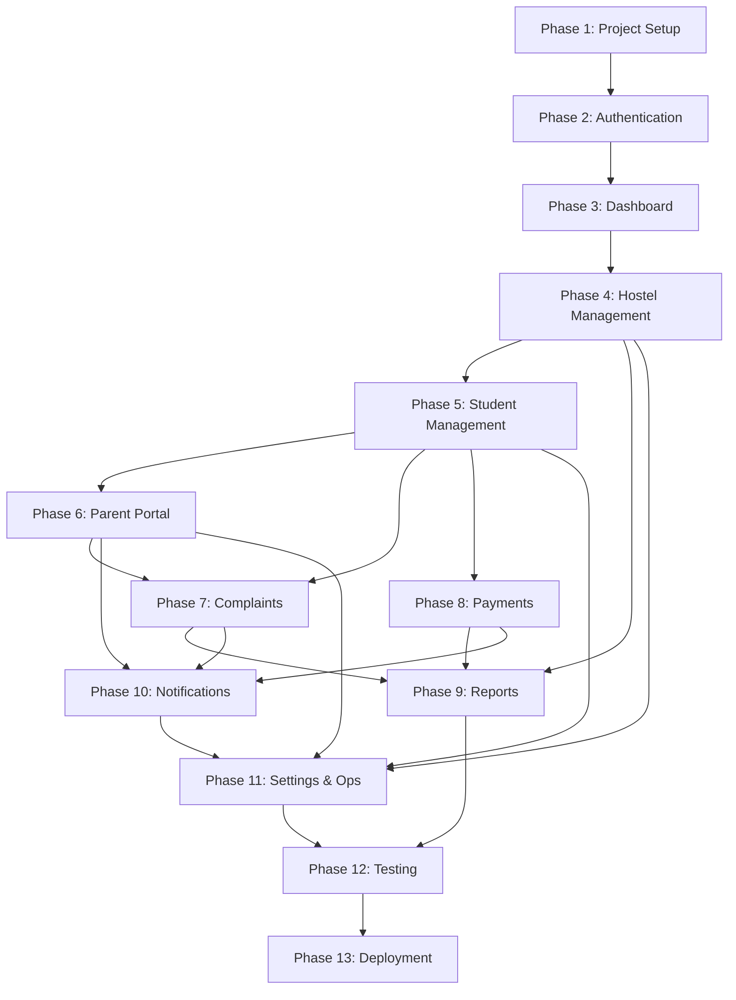

# Hostylia — Phases.md

**Scope:** v1 (Ship) per PRD Sec. 10, delivered across 13 sequential phases. Each phase is deployable/demoable on its own; later phases depend on earlier ones per the Dependencies column.
**Stack reference:** React + Vite + **TypeScript (strict)** + Tailwind + **shadcn/ui** + React Router + TanStack Query + Supabase (Auth, Postgres, Storage, Realtime, Edge Functions). Lovable-native.
**Version:** 2.0 · **Last updated:** July 15, 2026
**Table names are authoritative in `DB-Schema.md`** — every table referenced below uses the exact `DB-Schema.md` name.

---

## Phase 1 — Project Setup

**Objective:** Stand up the codebase, Supabase project(s), CI pipeline, and design foundations so every later phase builds on a working skeleton.

| Aspect | Details |
|---|---|
| **Features** | Repo scaffold, environment config, base routing shell, design tokens wired into Tailwind, CI (lint/build/test), Supabase project provisioning (local + staging + production) |
| **Pages** | Empty `AuthLayout`, placeholder `/login`, 404 page, 403 page |
| **Components** | `components/ui/` primitives: Button, Input, Select, Card, Badge, Modal, Table, Toast, Skeleton |
| **Database Tables** | `tenants`, `organizations`, `properties`, `profiles`, `plans`, `subscriptions`, `rate_limits` (schema only, no business data yet) |
| **Supabase Features** | Project created (local/staging/prod), CLI-managed migrations initialized, RLS enabled by default policy stub, all DB access routed through the Supabase pooler (Supavisor/PgBouncer) per `Rules.md` Sec. 23.1b |
| **Authentication** | Supabase Auth enabled (phone OTP + email/password providers configured); no app-level login flow yet |
| **Backend Logic** | Base migration structure (`supabase/migrations/`), `audit_logs` table + generic trigger scaffold, `checkRateLimit()` `SECURITY DEFINER` function over `rate_limits` (Postgres limiter; Upstash is the deferred Stage-3 swap per `Architecture.md` Sec. 26.3) |
| **UI Tasks** | Tailwind config with design tokens from `Design.md`, base layout shell (Topbar/Sidebar/BottomNav components, unwired), font/icon setup |
| **Testing Checklist** | ☐ `vite build` (TypeScript strict) succeeds ☐ CI pipeline runs typecheck+lint+build on PR ☐ Local Supabase stack boots via CLI ☐ Staging Supabase project reachable from app ☐ `checkRateLimit()` returns true under limit and false over limit |
| **Completion Criteria** | A developer can clone the repo, run `supabase start` + `npm run dev`, and see a styled placeholder shell with routing working. |
| **Estimated Difficulty** | Low |
| **Dependencies** | None (first phase) |

---

## Phase 2 — Authentication

**Objective:** Working login for all 6 roles, session persistence, and role resolution — the gate every later phase's routes sit behind.

| Aspect | Details |
|---|---|
| **Features** | Phone OTP login (all roles), email+password login (Admin/Accountant/Warden), session persistence, role-based redirect after login, logout |
| **Pages** | `/login`, `/verify-otp`, `/access-pending` (Parent not yet linked to a student) |
| **Components** | `LoginForm`, `OtpInput`, `RoleRedirect`, `AuthLayout` |
| **Database Tables** | `profiles`, `tenant_memberships`, `role_assignments` (user↔property/block↔role), `platform_role_assignments` (Super Admin), `guardians`, `student_guardians` |
| **Supabase Features** | Auth (GoTrue) phone OTP + email/password providers live; trigger on `auth.users` insert to create `profiles` row |
| **Authentication** | Full flow: OTP send/verify, email/password sign-in, session refresh, `AuthProvider` context resolving role + org + property scope |
| **Backend Logic** | RLS enabled on `profiles`/`role_assignments`/`tenant_memberships`/`guardians` (self-row + Admin-scoped access); Parent-linking check (guardian phone must match an existing `guardians.phone`); OTP endpoints call `checkRateLimit()` |
| **UI Tasks** | Login screens per `Design.md` (mobile-first for phone-OTP roles), loading/error states for OTP verification, role-based landing redirect |
| **Testing Checklist** | ☐ Phone OTP round-trip works end-to-end ☐ Email/password login works ☐ Wrong-role deep link redirects to 403 ☐ Unlinked parent phone shows access-pending screen ☐ Session persists across reload ☐ Logout clears session + Query cache ☐ OTP requests are rate-limited (repeated sends blocked within window) ☐ Auth inputs validated against shared Zod schemas (email/phone/password/OTP) |
| **Completion Criteria** | Every one of the 6 roles can log in and land on an (empty) role-appropriate dashboard shell. |
| **Estimated Difficulty** | Medium |
| **Dependencies** | Phase 1 |

---

## Phase 3 — Dashboard

**Objective:** Role-specific dashboard shells with navigation, so every later feature phase has a home to plug into.

| Aspect | Details |
|---|---|
| **Features** | Role-based layouts (Admin/Accountant desktop-dense; Warden/Student/Parent mobile bottom-nav; Super Admin desktop), property switcher (multi-property Admin), empty-state dashboard widgets |
| **Pages** | `/admin/dashboard`, `/accountant/dashboard`, `/warden/daily-brief`, `/student/home`, `/parent/overview`, `/super-admin/dashboard` |
| **Components** | `Sidebar`, `Topbar`, `BottomNav`, `PropertySwitcher`, `PageHeader`, dashboard `KpiCard`, `EmptyState` |
| **Database Tables** | No new tables — reads placeholder/zero-state data from Phase 1–2 tables |
| **Supabase Features** | None new — first use of TanStack Query + Supabase client together |
| **Authentication** | `RoleGuard` route wrapper enforcing per-role route trees (Sec. 7 of `Architecture.md`) |
| **Backend Logic** | None new |
| **UI Tasks** | Navigation config per role, responsive breakpoints validated at 360px–1440px, skeleton loaders for dashboard widgets |
| **Testing Checklist** | ☐ Each role sees only its own nav items and routes ☐ Deep-linking to another role's route redirects to 403 ☐ Property switcher changes active property context ☐ Mobile bottom-nav usable at 375px width |
| **Completion Criteria** | Each role has a navigable, responsive dashboard shell with real (if empty) KPI placeholders wired to Query. |
| **Estimated Difficulty** | Medium |
| **Dependencies** | Phase 2 |

---

## Phase 4 — Hostel Management (Property / Block / Floor / Room / Bed)

**Objective:** Build the property hierarchy CRUD — the foundation every other domain (students, finance, ops) hangs off of.

| Aspect | Details |
|---|---|
| **Features** | Property creation/config (amenities, rules, branding, cover photos), Block/Floor/Room/Bed manager, bulk CSV import, occupancy grid |
| **Pages** | `/admin/properties`, `/admin/properties/:id/setup`, `/admin/properties/:id/structure` (Block/Floor/Room/Bed tree + grid) |
| **Components** | `PropertyForm`, `BedGrid`, `RoomCard`, `CsvImportModal`, `BrandingUploader` |
| **Database Tables** | `properties`, `blocks`, `floors`, `rooms`, `beds` |
| **Supabase Features** | Storage bucket `property-public-assets` (logos/cover photos, public read), RLS on structure tables (Admin full CRUD, Warden view + limited edit, others view-only within scope) |
| **Authentication** | No change — reuses Phase 2 auth |
| **Backend Logic** | `fn_flip_bed_status()` trigger scaffold (fires later once Allocation exists in Phase 5), CSV import validation (server-side constraint checks on bulk insert) |
| **UI Tasks** | Multi-property roll-up view for chains, bed-status color coding per `Design.md`, mobile-usable bed grid |
| **Testing Checklist** | ☐ Admin can create a property end-to-end ☐ CSV bulk import creates correct Block→Floor→Room→Bed tree ☐ Block is optional for small properties ☐ RLS blocks a Warden from editing structure outside their assigned block ☐ Bed grid reflects vacant/occupied/blocked/maintenance states |
| **Completion Criteria** | A Hostel Admin can fully configure a property's physical structure and see it reflected in a live occupancy grid. |
| **Estimated Difficulty** | Medium-High |
| **Dependencies** | Phase 3 |

---

## Phase 5 — Student Management

**Objective:** Student lifecycle — admission, KYC, allocation, agreement, move-out — the core entity most other modules reference.

| Aspect | Details |
|---|---|
| **Features** | Public digital admission form, KYC upload + document vault, bed allocation with one-tap swap, digital agreement + click-wrap acceptance, lock-in/notice tracking, move-out workflow with refund calculation, bulk admission import, archive-on-move-out |
| **Pages** | `/apply/:propertySlug` (public), `/admin/students`, `/admin/students/:id`, `/admin/allocations`, `/admin/students/:id/move-out` |
| **Components** | `AdmissionForm`, `KycUploadForm`, `AllocationBoard`, `AgreementViewer`, `MoveOutWizard`, `StudentCard` |
| **Database Tables** | `students`, `allocations`, `documents` |
| **Supabase Features** | Storage buckets `kyc-documents` and `agreements` (private, scoped RLS-equivalent policies), `fn_flip_bed_status()` trigger now live end-to-end |
| **Authentication** | Public admission form works unauthenticated (creates a draft `students` row); guardian phone captured here feeds Parent-linking from Phase 2 |
| **Backend Logic** | `fn_flip_bed_status()`, notice-period/lock-in calculation function, move-out refund-calc function (deposit ledger read, dues check) |
| **UI Tasks** | Mobile-first public admission form, camera capture for KYC (PRD Sec. 6.9.4), allocation drag/tap-to-assign UI, click-wrap acceptance capture component (records accepted_at, IP, user-agent, document hash) |
| **Testing Checklist** | ☐ Public admission form submits without login ☐ KYC files upload to private bucket with correct scoping ☐ Allocation flips bed status correctly ☐ Agreement click-wrap acceptance captured and stored (signature_method=CLICK_CONSENT) ☐ Move-out archives student (soft state, not deleted) and recalculates bed to vacant ☐ Bulk import handles malformed rows gracefully |
| **Completion Criteria** | A student can be admitted end-to-end (form → KYC → allocation → agreement) and later moved out, with the bed lifecycle correctly reflected throughout. |
| **Estimated Difficulty** | High |
| **Dependencies** | Phase 4 |

---

## Phase 6 — Parent Portal

**Objective:** Give linked guardians visibility into their child's status — read-first, pay-second.

| Aspect | Details |
|---|---|
| **Features** | Parent portal shell, child snapshot (attendance streak, dues), attendance/gate history, complaint tracker (read), direct messaging with warden, multilingual (English + Hindi) toggle |
| **Pages** | `/parent/overview`, `/parent/attendance`, `/parent/complaints`, `/parent/messages` |
| **Components** | `ChildSnapshotCard`, `AttendanceHistoryList`, `ComplaintTrackerList`, `WardenChatThread`, `LanguageSwitcher` |
| **Database Tables** | `student_guardians` (already scaffolded Phase 2), `messages` (warden↔parent thread) |
| **Supabase Features** | RLS: Parent sees only linked-student data (`student_guardians` join, per `Architecture.md` Sec. 12 example policy); Realtime channel for messages |
| **Authentication** | No change — Parent phone-OTP flow from Phase 2 now has real data to land on |
| **Backend Logic** | None beyond existing linkage; message thread scoped per student per property |
| **UI Tasks** | Mobile bottom-nav Parent shell, i18n string externalization (English/Hindi) applied here first as the reference implementation for later phases |
| **Testing Checklist** | ☐ Parent sees only their own linked child(ren), never siblings' hostel-mates ☐ Attendance/gate history renders correctly from Phase-5/8 data as it comes online (stub data acceptable if Attendance/Gate not yet built) ☐ Language switcher persists preference ☐ Messaging thread scoped correctly per RLS |
| **Completion Criteria** | A linked Parent can log in, see their child's snapshot, and message the Warden — in English or Hindi. |
| **Estimated Difficulty** | Medium |
| **Dependencies** | Phase 5 |

---

## Phase 7 — Complaints

**Objective:** Full complaint lifecycle with SLA tracking and category-based auto-assignment.

| Aspect | Details |
|---|---|
| **Features** | Student-raised complaints with photos, category taxonomy + SLA per category, auto-assignment to Warden by category+block, rating on resolution + reopen flow, SLA-breach escalation |
| **Pages** | `/student/complaints`, `/warden/complaints`, `/admin/complaints`, `/parent/complaints` (read, built in Phase 6, now populated) |
| **Components** | `ComplaintForm`, `ComplaintCard`, `ComplaintTimeline`, `SlaBadge`, `RatingWidget` |
| **Database Tables** | `complaints`, `complaint_categories` |
| **Supabase Features** | Storage bucket `complaint-media`; Realtime channel `complaints:{propertyId}`; `pg_cron` scheduled `escalate-sla` Edge Function |
| **Authentication** | No change |
| **Backend Logic** | Auto-assignment function (category + block → Warden), SLA timer/escalation function, reopen-within-48h constraint |
| **UI Tasks** | Live status updates via Realtime, mobile-first complaint raise flow for Student, Warden triage queue with SLA countdown badges |
| **Testing Checklist** | ☐ Complaint auto-assigns to correct Warden by block ☐ SLA badge counts down correctly and escalates to Admin on breach ☐ Reopen only allowed within 48h of resolution ☐ Realtime updates complaint status live across Student/Warden/Admin views without refresh |
| **Completion Criteria** | A complaint can be raised, auto-routed, resolved, rated, and (if needed) reopened, with live status visible to all relevant roles. |
| **Estimated Difficulty** | Medium-High |
| **Dependencies** | Phase 5, Phase 6 |

---

## Phase 8 — Payments (Finance & Fees)

**Objective:** The revenue engine — fee plans, invoicing, payment collection, receipts, refunds, and aging/DSO reporting.

| Aspect | Details |
|---|---|
| **Features** | Configurable fee plans, auto-invoice generation on billing cycle, UPI/card/netbanking payments (Razorpay), cash/cheque entry with receipt, auto-receipts (PDF+WhatsApp+email), GST invoicing, fee reminders, aging reports, owner P&L, discounts/waivers with approval, refunds with maker-checker, deposit ledger |
| **Pages** | `/admin/finance/fee-plans`, `/admin/finance/invoices`, `/accountant/invoices`, `/accountant/payments`, `/accountant/refunds`, `/admin/finance/pnl`, `/student/fees`, `/parent/payments` |
| **Components** | `FeePlanForm`, `InvoiceTable`, `InvoiceDetail`, `PaymentEntryForm`, `RefundRequestForm`, `AgingReportChart`, `PnlSummary`, `ReceiptViewer` |
| **Database Tables** | `fee_plans`, `invoices`, `payments`, `refunds` |
| **Supabase Features** | Edge Functions: `razorpay-webhook`, `generate-receipt`, `process-refund`, `generate-invoices` (scheduled); Storage bucket `receipts`; RPC `fn_approve_refund` |
| **Authentication** | No change |
| **Backend Logic** | `fn_generate_invoices()` (scheduled, idempotent), maker-checker refund flow (Accountant initiates → Admin approves via RPC), deposit ledger auto-adjustment on move-out (ties back to Phase 5's move-out wizard) |
| **UI Tasks** | Payment entry flows for Accountant/Admin, one-tap pay for Student/Parent, aging report visualization (0-30/31-60/60+), P&L summary view |
| **Testing Checklist** | ☐ Invoices auto-generate correctly per active allocation on cycle day ☐ Razorpay payment completes and webhook flips invoice status ☐ Cash/cheque entry generates receipt correctly ☐ Refund cannot bypass maker-checker (Accountant-only insert cannot self-approve) ☐ Aging report numbers match manual calculation on test data ☐ GST invoice fields render correctly |
| **Completion Criteria** | A full fee cycle — invoice generation → payment (online or cash) → receipt → reminder → aging visibility — works end-to-end, and a refund can be initiated and approved under maker-checker. |
| **Estimated Difficulty** | High |
| **Dependencies** | Phase 5 |

---

## Phase 9 — Reports

**Objective:** Cross-cutting analytics surfaces layered on top of data now flowing from Phases 4–8.

| Aspect | Details |
|---|---|
| **Features** | Occupancy accuracy report, DSO/aging (extends Phase 8), complaint SLA compliance report, attendance summary, exportable reports (CSV/PDF) |
| **Pages** | `/admin/reports`, `/accountant/reports` (finance-scoped), `/warden/reports` (assigned-scope) |
| **Components** | `ReportFilterBar`, `ReportTable`, `ExportButton`, chart components (`DsoChart`, `OccupancyChart`, `SlaComplianceChart`) |
| **Database Tables** | No new tables — read-only aggregation views/materialized views over existing tables as needed for performance |
| **Supabase Features** | Optional materialized views for heavy aggregations (per `Architecture.md` Sec. 24 scalability note); `.range()` pagination on export queries |
| **Authentication** | No change — reports respect existing RBAC export permissions (`X` in PRD Sec. 7 matrix) |
| **Backend Logic** | Aggregation queries/views; CSV/PDF export generation (client-side for CSV, Edge Function for PDF if needed) |
| **UI Tasks** | Chart components per `Design.md`, responsive report tables, export affordances scoped by role |
| **Testing Checklist** | ☐ Each role sees only reports within their permission scope ☐ Export respects RLS (no cross-tenant leakage) ☐ Report numbers reconcile against source tables ☐ Large-property reports paginate/virtualize correctly |
| **Completion Criteria** | Admin, Accountant, and Warden each have a working, exportable, role-scoped reporting surface. |
| **Estimated Difficulty** | Medium |
| **Dependencies** | Phase 4, Phase 7, Phase 8 |

---

## Phase 10 — Notifications

**Objective:** Multi-channel notice broadcast and the underlying dispatch infrastructure used across the app (fee reminders, gate events, SLA escalations all route through this).

| Aspect | Details |
|---|---|
| **Features** | Notice board + multi-channel broadcast (in-app/SMS/WhatsApp), notification preferences, entry/exit instant parent SMS, fee reminders (SMS/WhatsApp/email/in-app) |
| **Pages** | `/warden/notices` (composer), `/admin/notices`, `/student/notices`, `/parent` notice feed (surfaced on Overview from Phase 6) |
| **Components** | `NoticeComposer`, `NoticeFeed`, `NotificationBell`, `ChannelPicker` |
| **Database Tables** | `notices`, `notification_log` |
| **Supabase Features** | Edge Function `send-notification` (single dispatcher for SMS/WhatsApp/email) now wired to all callers: Phase 7's SLA escalation, Phase 8's fee reminders, gate events (Phase 4/warden ops), notice broadcast; Realtime channel `notices:{propertyId}` |
| **Authentication** | No change |
| **Backend Logic** | `send-notification` dispatcher abstraction (`{channel, templateId, recipient, variables}`), delivery status logging in `notification_log` |
| **UI Tasks** | Notice composer with audience targeting (all/students/parents/staff), live notice feed via Realtime, notification bell with unread count |
| **Testing Checklist** | ☐ Notice broadcasts to correct audience and channels ☐ SMS/WhatsApp/email dispatch succeeds against sandbox gateway credentials ☐ Notification log records delivery status per channel ☐ Realtime notice feed updates without refresh |
| **Completion Criteria** | A Warden can broadcast a notice across in-app/SMS/WhatsApp, and every earlier phase's notification touchpoints (fee reminders, SLA escalation, gate events) route through the same dispatcher. |
| **Estimated Difficulty** | Medium |
| **Dependencies** | Phase 6, Phase 7, Phase 8 |

---

## Phase 11 — Settings (incl. Attendance, Gate Pass/Mess ops, Staff, Super Admin console)

**Objective:** Close out remaining v1-Ship operational modules and account-level configuration — attendance, gate pass/visitor management, mess menu, staff invites, property branding/settings, and the Super Admin console.

| Aspect | Details |
|---|---|
| **Features** | Digital attendance (bulk, per-room), QR gate pass/out-pass with approval + scan, entry/exit logs with parent SMS (uses Phase 10 dispatcher), visitor management, emergency alert, mess menu + weekly planner + headcount, feedback surveys, staff invite/remove (Warden/Accountant), property settings/branding, Super Admin console (tenant onboarding, subscription/billing, MRR/churn dashboard, feature flags, time-boxed impersonation) |
| **Pages** | `/warden/attendance`, `/warden/gate-pass`, `/warden/mess`, `/student/gate-pass`, `/student/mess`, `/admin/staff`, `/admin/settings`, `/super-admin/tenants`, `/super-admin/billing`, `/super-admin/feature-flags`, `/super-admin/impersonation` |
| **Components** | `AttendanceGrid`, `GatePassQr`, `GatePassApprovalCard`, `VisitorForm`, `MessMenuEditor`, `FeedbackSurveyForm`, `StaffInviteForm`, `TenantTable`, `MrrChurnChart`, `FeatureFlagToggle`, `ImpersonationBanner` |
| **Database Tables** | `attendance`, `gate_passes`, `gate_pass_approvals`, `gate_events`, `visitors`, `mess_menus`, `mess_menu_items`, `mess_headcounts`, `mess_feedback`, `feedback_surveys`, `feedback_responses`, `role_assignments` (invite flow), `subscriptions` + `plans` + `plan_features` + `tenant_feature_overrides` (Super Admin billing & flags) |
| **Supabase Features** | Realtime channels `gate-events:{propertyId}` and `bed-status` (verifying Phase 4 grid still live); Edge Function `impersonate-tenant`; `service_role`-based Super Admin cross-tenant queries per `Architecture.md` Sec. 12 |
| **Authentication** | Staff invite flow issues scoped `role_assignments` rows (Warden/Accountant onboarding); Super Admin impersonation session minting |
| **Backend Logic** | `fn_check_gatepass_curfew()` trigger, QR generation/validation logic, staff invite token flow, impersonation consent-logging + time-box enforcement |
| **UI Tasks** | Fast bulk attendance marking (target: 3 min per PRD Sec. 8.7), QR scan UI (camera-based) for gate, mess weekly planner grid, Super Admin desktop-dense console views, visible impersonation banner |
| **Testing Checklist** | ☐ Bulk attendance marks correctly and quickly ☐ Gate pass QR issues, scans, and logs entry/exit with parent SMS firing ☐ Curfew/late-entry alert triggers correctly ☐ Staff invite creates correctly scoped `role_assignments` row ☐ Super Admin can onboard a tenant and toggle a feature entitlement via `tenant_feature_overrides` ☐ Impersonation is time-boxed, logged, and shows the required banner to the Hostel Admin post-session |
| **Completion Criteria** | All remaining v1-Ship features from PRD Sec. 6 are functional; Super Admin console is fully operable for tenant lifecycle management. |
| **Estimated Difficulty** | High |
| **Dependencies** | Phase 4, Phase 5, Phase 6, Phase 10 |

---

## Phase 12 — Testing

**Objective:** Harden the full v1 feature set — RLS correctness, cross-role permission boundaries, accessibility, and performance — before deployment.

| Aspect | Details |
|---|---|
| **Features** | RLS policy test suite, RBAC boundary tests (per PRD Sec. 7 matrix), accessibility audit (WCAG 2.1 AA per PRD Sec. 9), performance audit against NFR budgets (dashboard <2s p95, API p95 <200ms), cross-browser/device testing |
| **Pages** | N/A — testing phase, no new pages |
| **Components** | N/A |
| **Database Tables** | No new tables; test fixtures/seed data (`supabase/seed.sql`) expanded to cover all 6 roles × representative entities |
| **Supabase Features** | `supabase/tests/` RLS test suite run against local/staging stack |
| **Authentication** | Verify session refresh, OTP edge cases (expired/wrong code), impersonation expiry |
| **Backend Logic** | Load-test scheduled functions (`generate-invoices`, `escalate-sla`) against realistic data volumes |
| **UI Tasks** | Accessibility pass on all forms/tables/modals (keyboard nav, screen reader labels, color contrast), responsive audit at 360px–1440px |
| **Testing Checklist** | ☐ Every RLS policy has a passing/failing test pair (authorized vs. unauthorized) ☐ Every Sec. 7 matrix cell has a corresponding automated check ☐ Lighthouse/axe accessibility score meets AA on core flows ☐ Dashboard load times meet <2s p95 on staging data volume ☐ Payment/refund flows tested against Razorpay sandbox including failure paths ☐ Cross-browser check: latest 2 versions Chrome/Safari/Edge/Firefox + iOS 15+ Safari + Android 10+ Chrome |
| **Completion Criteria** | All NFRs from PRD Sec. 9 are met and verified; no known RLS or RBAC boundary gap; accessibility sign-off obtained. |
| **Estimated Difficulty** | High |
| **Dependencies** | Phases 1–11 |

---

## Phase 13 — Deployment

**Objective:** Ship v1 to production with backups, monitoring, and a rollback plan in place.

| Aspect | Details |
|---|---|
| **Features** | Production Supabase project cutover, production frontend deploy, daily automated backups + 30-day retention + point-in-time recovery, monitoring/alerting, domain + SSL, data-residency confirmation (India) |
| **Pages** | N/A |
| **Components** | N/A |
| **Database Tables** | Final production migration apply (all tables from Phases 1–11) |
| **Supabase Features** | Production project backup policy configured, Edge Function secrets set for production gateway credentials (Razorpay live keys, SMS/WhatsApp production tokens) |
| **Authentication** | Production Auth provider settings (rate limits, redirect URLs) locked down |
| **Backend Logic** | Final RLS review against production data; `pg_cron` jobs verified running on production schedule |
| **UI Tasks** | Production build verification, error-tracking (Sentry or equivalent) wired to production, favicon/PWA manifest finalized |
| **Testing Checklist** | ☐ Production smoke test across all 6 roles ☐ Backup + point-in-time recovery verified with a test restore ☐ Live payment gateway transaction verified end-to-end ☐ SMS/WhatsApp delivery verified in production ☐ Rollback plan documented and dry-run once ☐ Monitoring/alerting fires correctly on a simulated failure |
| **Completion Criteria** | Hostylia v1 is live in production, meeting the PRD Sec. 2.2 KPIs' technical prerequisites (uptime, TTFV path, backup policy), with a documented rollback procedure. |
| **Estimated Difficulty** | Medium |
| **Dependencies** | Phase 12 |

---

## Phase Dependency Overview

**Note on Stage 2/Stage 3 items:** Everything marked `[F]` (Fast-follow) or `[R]` (Roadmap) in PRD Sec. 6 — PWA offline, web push, split payments, waitlist, public microsite, granular privilege toggles, **Aadhaar eSign/DSC**, AI Suite, biometric/RFID, **outbound** public API/webhooks, **Upstash Redis rate limiting**, read replicas, bank reconciliation, BI connectors — is intentionally excluded from Phases 1–13. Per `Architecture.md` Sec. 26.3 (Scale Seams), the v1 architecture is built so these land as additive phases (14+) without structural rewrites — the rate-limiter, read-replica, and worker-tier seams are already defined.
